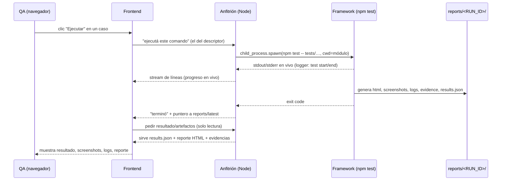

# Panel de Control Web — Diseño Arquitectónico (versión mínima)

> **Rol de este documento.** Diseño de arquitectura de una **pequeña interfaz web** que actúa como panel de control del framework existente. NO es código, NO es implementación, NO diseña colores ni estilos. Es una **capa de presentación**: el trabajo real sigue ocurriendo dentro del framework.
>
> **Es ADITIVO y no reemplaza nada.** Asume aprobados el [README](../README.md), las [Guidelines](../CLAUDE_FRAMEWORK_GUIDELINES.md) y el [documento de arquitectura de la plataforma](./plataforma-de-control-arquitectura.md). Este panel es una **realización deliberadamente mínima** de la *Fase 1* (descubrimiento + lectura) y una rebanada de la *Fase 2* (ejecución bajo demanda) de aquel documento — se detiene muy lejos de la plataforma completa a propósito.
>
> **Lo que NO es (declaración explícita de alcance):** no es TestRail, no es Jenkins, no es Allure, no es una plataforma empresarial. No tiene base de datos, no tiene historial propio, no tiene modelo de dominio propio, no reimplementa nada del framework. Si una funcionalidad ya existe en el framework, el panel **la muestra**, no la rehace.

---

## 0. Índice

- [1. Filosofía y principios de diseño](#1-filosofía-y-principios-de-diseño)
- [2. Organización general](#2-organización-general)
- [3. Estructura de carpetas](#3-estructura-de-carpetas)
- [4. Componentes](#4-componentes)
- [5. Descubrimiento automático](#5-descubrimiento-automático)
- [6. Command Discovery: cada caso conoce su comando](#6-command-discovery-cada-caso-conoce-su-comando)
- [7. Integración con el framework y con `npm test`](#7-integración-con-el-framework-y-con-npm-test)
- [8. Flujo de ejecución](#8-flujo-de-ejecución)
- [9. Progreso en vivo](#9-progreso-en-vivo)
- [10. Manejo del Execution Context / Input Model](#10-manejo-del-execution-context--input-model)
- [11. Visualización de reportes, evidencias, screenshots, logs y código](#11-visualización-de-reportes-evidencias-screenshots-logs-y-código)
- [12. Historial](#12-historial)
- [13. Tecnología: análisis objetivo](#13-tecnología-análisis-objetivo)
- [14. Extensibilidad](#14-extensibilidad)
- [15. Ventajas](#15-ventajas)
- [16. Riesgos](#16-riesgos)
- [17. Decisiones tomadas](#17-decisiones-tomadas)
- [18. Posibles mejoras futuras](#18-posibles-mejoras-futuras)
- [19. Cierre](#19-cierre)

---

## 1. Filosofía y principios de diseño

El panel existe para eliminar un solo dolor: **hoy hay que abrir una consola, recordar el comando exacto y después buscar a mano el reporte/evidencias en carpetas**. El panel convierte eso en "clic → veo correr → veo el resultado", sin agregar ninguna capacidad nueva al framework.

| # | Principio | Consecuencia de diseño |
|---|---|---|
| F1 | **Capa de presentación pura.** | El panel no *decide* nada de testing; lee lo que el framework produce y ejecuta lo que el framework define. |
| F2 | **Cero duplicación.** | No hay historial propio, ni reportes propios, ni base de datos, ni un segundo formato de datos. Se reutilizan `reports/`, `execution-context.json`, `metadata/`. |
| F3 | **Cero registro manual.** | Ningún archivo lista los tests. Todo se **descubre** del filesystem cada vez. |
| F4 | **El comando no vive en la UI.** | La forma de ejecutar un caso la define el framework (convención). La UI solo ejecuta "el comando que le dieron". Si cambia la forma de correr, la UI no se toca. |
| F5 | **Mínima superficie, mínimas dependencias.** | Coherente con las Guidelines del framework ("pocas dependencias, aditivo, mantenible"). Sin build step si se puede evitar. |
| F6 | **Ejecuta exactamente lo mismo que la consola.** | El panel corre el mismo `npm test -- …` que un humano correría. No hay una vía de ejecución paralela que pueda divergir. |
| F7 | **El motor es invisible.** | El panel no sabe qué es Selenium. Muestra casos, corre comandos, lee artefactos. Sirve igual el día que un caso corra con otro motor. |

---

## 2. Organización general

### 2.1. Por qué el panel necesita **dos piezas** (y no una)

Hay una restricción física ineludible: **un navegador no puede lanzar procesos (`spawn`) ni leer el filesystem**. Sólo Node puede hacer `child_process.spawn` y leer `reports/`. Por lo tanto el panel es, inevitablemente, dos piezas:

1. **Proceso anfitrión local (backend mínimo en Node).** Corre en la máquina del QA. Es lo único que puede: descubrir archivos, `spawn` del comando de test, transmitir su salida, y servir los artefactos ya generados.
2. **Frontend estático (lo que se ve en el navegador).** Un árbol tipo explorador + un panel de detalle. No contiene lógica de testing; pide datos al anfitrión y muestra.

```mermaid
flowchart LR
    subgraph Navegador["Navegador (frontend estático)"]
      UI["Árbol de módulos/tests\n+ panel de detalle\n+ vista en vivo"]
    end
    subgraph Local["Proceso anfitrión local (Node mínimo)"]
      DISC["Descubridor\n(escanea el filesystem)"]
      LAUNCH["Lanzador\n(spawn del MISMO npm test)"]
      STATIC["Servidor de archivos\n(reports/ ya existentes)"]
    end
    subgraph FW["Framework existente (SIN cambios)"]
      TESTS["tests/*.test.js"]
      RUNNER["triple-run-tests\n(npm test)"]
      REPORTS["reports/<RUN_ID>/\n(html, screenshots, logs, evidence, results.json)"]
      EC["data/execution-context.json"]
      META["metadata/screens/*.json"]
    end

    UI <-->|lee árbol / dispara run / stream| DISC & LAUNCH & STATIC
    DISC -->|escanea| TESTS
    LAUNCH -->|spawn| RUNNER
    RUNNER -->|genera| REPORTS
    STATIC -->|sirve| REPORTS
    UI -->|edita| EC
    DISC -->|lee (opcional)| META
```

### 2.2. El anfitrión **NO** es una "Runner API"

Esto merece decirse con todas las letras porque el requisito lo prohíbe: el anfitrión **no** es una Runner API ni tiene "endpoints para ejecutar pruebas" en el sentido de una abstracción que sepa *cómo* se corren los tests. No hay lógica de ejecución propia. El anfitrión es una **pasarela de comando transparente**: recibe "ejecutá este string de comando" (el string lo produjo el descubrimiento, es decir, el framework) y hace `spawn`. No conoce mochas, ni engines, ni casos. La diferencia es la que hay entre *un botón que aprieta el mismo comando que apretarías vos* y *un servicio que reimplementa la ejecución*. Construimos lo primero.

> Analogía: es un "doble clic" sobre el comando de consola, no un orquestador. Todo lo que sabe hacer es lo que ya sabés hacer vos en la terminal.

---

## 3. Estructura de carpetas

El panel vive como una carpeta nueva del monorepo, **aislada**, sin que el core ni los módulos la conozcan (dependencia en un solo sentido: el panel conoce al framework, nunca al revés).

```
testing/                          # monorepo actual (sin cambios)
├── core/                         # framework (intacto)
├── reclutamiento/                # módulo (intacto)
├── docs/                         # documentos de arquitectura (este incluido)
└── panel/                        # ← NUEVO. La app. Aislada y opcional.
    ├── anfitrion/                # backend mínimo en Node
    │   ├── (descubridor)         # escanea workspaces + tests/*.test.js
    │   ├── (lanzador)            # spawn del comando; stream de salida
    │   └── (servidor estático)   # sirve el frontend y los reports/ existentes
    └── web/                      # frontend estático (sin build)
        ├── index.html            # una sola página
        ├── (estilos)             # CSS
        └── (lógica)              # JS de vista (árbol, detalle, vivo)
```

Decisiones de ubicación:
- **`panel/` como workspace nuevo (o carpeta suelta).** Como workspace, es coherente con el monorepo y `npm` ya lo instala. Como carpeta suelta fuera de `workspaces`, queda aún más desacoplada. Cualquiera de las dos respeta que **el framework no depende del panel**.
- **Nada dentro de `core/` ni de los módulos cambia.** El panel es 100% aditivo: si se borra la carpeta `panel/`, el framework sigue idéntico.

---

## 4. Componentes

Sólo cinco piezas conceptuales, ninguna con lógica de testing propia:

| Componente | Responsabilidad única | Qué **no** hace |
|---|---|---|
| **Descubridor** | Recorre el filesystem y arma el árbol (módulos → carpetas → casos) con el comando de cada uno. | No parsea el motor, no ejecuta, no cachea historial. |
| **Lanzador** | Hace `spawn` del comando que le pasan y transmite su stdout/stderr en vivo. Permite cancelar (matar el proceso). | No sabe qué es un test; no interpreta resultados (los lee el framework y quedan en `reports/`). |
| **Servidor de archivos** | Sirve el frontend estático y expone (solo lectura) las carpetas `reports/` que el framework ya generó. | No transforma reportes; sirve el HTML tal cual. |
| **Editor de contexto** | Lee y guarda la sección del caso en `data/execution-context.json` (renderizando el Input Model). | No inventa campos; no valida reglas de negocio del motor. |
| **Vista (frontend)** | Árbol tipo explorador + panel de detalle + vista en vivo. | No contiene comandos hardcodeados; no conoce el motor. |

---

## 5. Descubrimiento automático

**Regla dura: el panel nunca tiene una lista de tests.** El árbol se construye escaneando el filesystem, apoyándose en la misma convención que el framework ya impone ("un caso = un archivo", "el nombre descriptivo es la fuente de verdad", "módulo = workspace").

**Algoritmo conceptual del descubridor (no implementación):**
1. **Módulos** = los `workspaces` del `package.json` raíz que contengan una carpeta `tests/` (hoy: `reclutamiento`; mañana `nomina`, `portal`… aparecen solos).
2. **Casos** = cada archivo `tests/**/*.test.js` de cada módulo. El nombre visible se deriva del nombre del archivo (que **es** el nombre descriptivo del caso — la fuente de verdad).
3. **Carpetas / suites** = las subcarpetas reales bajo `tests/` si existen; y, como comodidad de presentación, una **agrupación derivada por prefijo del nombre** (`crear-req-*`, `publicar-*`, `pausar-*` → grupo "Requisiciones"). La agrupación por prefijo es solo visual y opcional; no crea entidades nuevas.
4. **Descripción / título** = si se quiere enriquecer, se lee de forma barata el título del `it`/`describe` o del Input Model; si no está disponible, se usa el nombre del archivo. Nunca se inventa.

**Frescura automática (extensibilidad, §14):** el descubridor **re-escanea cada vez que el frontend pide el árbol** (la operación es barata: listar archivos). Por eso, si mañana aparece `tests/compartir-requisicion.test.js`, aparece en la UI **sin tocar una línea** del panel. No hay caché que invalidar ni registro que actualizar.

> **Reutilización con el doc de arquitectura:** este descubridor es una versión reducida del *Manifiesto de Descubrimiento* (§7 de aquel documento). El panel produce el mismo tipo de árbol, pero por escaneo directo, sin el aparato completo del EnginePort — porque a esta escala no hace falta. Si el día de mañana existe el manifiesto formal, el panel puede **consumirlo en vez de escanear**, sin cambiar su UI.

---

## 6. Command Discovery: cada caso conoce su comando

Este es el corazón del desacople que pide el requisito: **el frontend no debe tener comandos hardcodeados**, y si mañana cambia la forma de ejecutar, la interfaz no debería modificarse.

### 6.1. Decisión: el comando lo produce el descubrimiento (framework), no la UI

Cada nodo descubierto viaja al frontend acompañado de su **descriptor**, que incluye el comando ya resuelto:

```jsonc
// Descriptor de un caso — ilustrativo, no implementación
{
  "nombre": "publicar-requisicion",
  "modulo": "reclutamiento",
  "ruta": "reclutamiento/tests/publicar-requisicion.test.js",
  "comando": { "cwd": "reclutamiento", "run": "npm test -- tests/publicar-requisicion.test.js" }
}
```

- El **frontend solo sabe ejecutar `comando`**. No sabe qué es `npm`, ni `tests/`, ni el motor.
- El **string del comando lo arma el descubridor** aplicando la **convención del framework** (hoy: `npm test -- tests/<archivo>` con `cwd` = el módulo). Esa convención vive en **un solo lugar** (el descubridor, del lado del que conoce el framework), no esparcida por la UI.

### 6.2. Los cuatro comandos, todos derivados de la misma convención

| Acción de la UI | `comando` que produce el descubridor | Nota |
|---|---|---|
| **Ejecutar test** | `npm test -- tests/<archivo>.test.js` (cwd = módulo) | Lo que corrés hoy a mano. |
| **Ejecutar carpeta** | `npm test -- "tests/<grupo>*.test.js"` (glob; el runner ya soporta globs) | Carpeta real o grupo por prefijo. |
| **Ejecutar módulo** | `npm test` (cwd = módulo) | Todos los tests del módulo. |
| **Ejecutar todos** | ejecutar el `comando` de cada módulo, o `npm test --workspace <módulo>` por cada uno | Se apoya en los scripts ya existentes. |

### 6.3. Por qué esto sobrevive a un cambio futuro

Si mañana la forma de correr cambia (otro flag, otro script, otro motor), **solo cambia cómo el descubridor arma el string `comando`**. El frontend sigue haciendo lo mismo: "ejecutá `comando.run` en `comando.cwd`". Esta es exactamente la propiedad pedida: *si cambia la forma de ejecutar los tests, la interfaz no debería modificarse*.

> **Alternativa descartada — comandos armados en el frontend:** el frontend concatenaría `"npm test -- tests/" + nombre`. Se descarta: hornea la convención de ejecución en la UI; cualquier cambio (un módulo con otro comando, otro motor) obligaría a tocar el frontend. Viola F4.
>
> **Alternativa descartada — un `comando` declarado a mano por caso:** volvería a ser registro manual (viola F3). El comando se **deriva**, no se declara.

---

## 7. Integración con el framework y con `npm test`

### 7.1. Ejecuta el mismo comando de consola, vía `spawn`

El lanzador hace `child_process.spawn` del **mismo** comando que el QA correría en la terminal (el `comando` del descriptor), con el `cwd` del módulo. No hay una segunda vía de ejecución: lo que corre el panel es idéntico a lo que corre un humano, así que **no puede divergir** del comportamiento real (F6). El framework hace todo lo demás como siempre: calcula `RUN_ID`, corre Mocha, genera el reporte en `reports/<RUN_ID>/` y `reports/latest/`, aplica retención `KEEP_REPORTS`.

### 7.2. "¿Hay una forma todavía mejor manteniendo esta filosofía?"

Se analizaron tres formas de disparar la ejecución; se mantiene el `spawn` del comando, con un matiz:

| Opción | Qué es | Veredicto |
|---|---|---|
| **A. `spawn` de `npm test -- <target>`** | Lanzar el mismo comando de consola. | **Elegida.** Máxima fidelidad ("exactamente lo mismo que hoy"), aislamiento de proceso (si el test crashea, no tumba al panel), y salida en vivo por stdout. |
| **B. `spawn` del bin `triple-run-tests` directamente** | Saltear la capa `npm` y llamar al binario del framework. | **Válida como optimización menor** (menos overhead de `npm`, paso de args más limpio). Mismo comportamiento. Se puede adoptar sin cambiar nada del diseño; se prefiere A por fidelidad literal al "comando de consola". |
| **C. Importar el runner y ejecutarlo en el mismo proceso (sin `spawn`)** | Cargar `triple-run-tests` como módulo y llamarlo. | **Descartada.** Acopla el panel al framework, y un fallo del test (o del navegador) podría tumbar el proceso del panel. Pierde el aislamiento que el propio doc de arquitectura eligió. |

**Conclusión:** `spawn` del comando (A) es la forma correcta y ya es "la mejor" bajo esta filosofía; (B) es una micro-optimización opcional. Lo importante —y lo que el requisito pide— es que **no se crea una Runner API**: el panel shell-ea el comando y nada más.

---

## 8. Flujo de ejecución



Puntos clave del flujo:
- El **progreso** sale del stdout en vivo; el **resultado estructurado** sale de `reports/latest/results.json` (Mochawesome) una vez que el proceso termina. Nada se recalcula.
- **Cancelar** = matar el proceso spawneado. Lo ya generado en `reports/` se conserva.
- El panel **nunca escribe en `reports/`**; solo lee.

---

## 9. Progreso en vivo

La forma más simple que da una sensación "en vivo" sin infraestructura pesada:
- El anfitrión **transmite las líneas de stdout** del proceso a medida que salen (el `logger` del framework ya imprime "Iniciando: …", "Finalizado: … [passed] (1234ms)" por cada test).
- El frontend muestra ese stream como una consola embebida y, si quiere, deriva un progreso grueso (contar "Iniciando/Finalizado").
- Al terminar el proceso, el frontend pide el resultado estructurado de `results.json` para las tarjetas de resumen (pasaron/fallaron/duración).

**Justificación:** streaming de stdout es el mínimo esfuerzo que ya da valor real (ver que "algo está pasando" y qué caso corre). Coincide con el "vivo derivado de logs (Fase 1)" del doc de arquitectura. **Alternativa descartada (por ahora):** un reporter de eventos de alta fidelidad (Fase 3 del doc grande) — excede el alcance "extremadamente simple"; se deja como mejora futura (§18) sin que el diseño actual la impida.

---

## 10. Manejo del Execution Context / Input Model

Es la **única** operación de escritura del panel, y respeta al pie de la letra la decisión aprobada (§18 del doc de arquitectura) y el principio "el usuario nunca inventa nombres".

- El panel **renderiza el Input Model** que el framework genera para el caso. No define campos: los pinta según su `type` (texto, enum con sus `options`, switch, archivo), con sus **nombres reales** y su `required`/`default`.
  - **Casos con formulario** → el Input Model trae *todos* los campos descubiertos de la metadata (nombres reales); el panel los muestra editables.
  - **Casos sin formulario** → el Input Model trae *solo* los parámetros mínimos declarados (p. ej. `nombreRequisicion`, `estado` de `pausar-requisicion`); el panel muestra solo esos.
- **Dejar un campo vacío es válido** y se indica ("vacío ⇒ el framework lo descubre automáticamente"), que es el comportamiento del runtime hoy.
- **Guardar** escribe en el **mismo** `data/execution-context.json`, en la sección del caso, respetando el formato editable a mano que ya existe (no pisa lo que no tocó; mismo criterio que `registrarCaso`). No hay un almacén nuevo.

**Degradación simple y honesta:** si en la fase mínima el Input Model completo aún no está disponible para un caso, el panel cae a mostrar **las claves ya presentes** en la sección del caso dentro de `execution-context.json` (las que `registrarCaso` sembró). Sigue sin inventar nada: muestra lo que el framework ya declaró. Cuando el Input Model esté disponible, el mismo panel lo renderiza sin cambios de diseño.

---

## 11. Visualización de reportes, evidencias, screenshots, logs y código

Todo proviene del framework; el panel **no genera ninguna fuente nueva de información**. Simplemente localiza y muestra lo que ya está en `reports/<RUN_ID>/` (y en el archivo del test).

| Qué se muestra | De dónde sale (ya existe) | Cómo lo muestra el panel |
|---|---|---|
| **Reporte HTML** | `reports/<RUN_ID>/html/index.html` (+ `reports/latest/`) — Mochawesome | Lo sirve tal cual y lo embebe (iframe) o lo abre en pestaña. **No lo re-renderiza.** |
| **Resultado / última ejecución** | `reports/latest/json/results.json` | Lee pasaron/fallaron/duración para las tarjetas de resumen. |
| **Screenshots** | `reports/<RUN_ID>/screenshots/<caso>/…png` | Galería (ya vienen agrupados por caso, con su `label`). |
| **Evidencias** | `reports/<RUN_ID>/evidence/{json,log,…}/<caso>/…` | Lista/enlaces; el JSON de bloqueo y demás se muestran como texto. |
| **Logs** | `reports/<RUN_ID>/logs/execution.log` | Texto plano, buscable. |
| **Código del test** | el archivo `ruta` del descriptor (o `results.json` trae `test.code`) | Bloque **colapsable, solo lectura**. |

**Justificación:** el reporte HTML ya es autocontenido y bueno; re-dibujarlo sería duplicar (viola F2). El panel aporta *navegación y contexto* (qué caso, qué corrida, junto al botón de ejecutar), no una nueva visualización.

---

## 12. Historial

**No hay historial propio.** El historial **son** las carpetas `reports/<RUN_ID>/` que el framework ya conserva y poda (`KEEP_REPORTS`). La forma más simple de presentarlo:

- Una **lista de corridas recientes** (por módulo o global), ordenada por `RUN_ID` (que es un timestamp, así que ordena solo).
- Cada fila: fecha/hora (del `RUN_ID`) + resumen pasaron/fallaron (de ese `results.json`) + enlace a **su** reporte HTML.
- Al abrir una fila, se ven sus screenshots/logs/evidencias de esa corrida (misma vista de §11, apuntando a ese `RUN_ID`).

Eso es todo. Sin base de datos, sin agregaciones, sin tendencias (eso vive en el doc de arquitectura grande, fuera de alcance aquí). Si mañana se quiere tendencia/flakiness, se agrega leyendo las mismas carpetas — pero **no** es parte de esta app mínima.

**Justificación:** "reutilizar el historial que el framework ya conserva" es literal: el panel lista carpetas y lee su `results.json`. Cualquier cosa más sería construir el Allure que explícitamente no se quiere.

---

## 13. Tecnología: análisis objetivo

La decisión se parte en dos porque las dos piezas tienen restricciones distintas.

### 13.1. Backend (anfitrión): **Node, con lo mínimo**

No es una elección de moda: es una **restricción**. Sólo Node puede `spawn` un proceso y leer `reports/`, y el framework **ya es Node** (reutiliza su runtime, sus workspaces, `child_process`, `fs`). Dentro de Node:
- **HTTP con el módulo `http` incorporado (o un micro-router mínimo)** — sin un framework web pesado. Las operaciones son pocas: dar el árbol, lanzar un comando, transmitir stdout, servir archivos, leer/guardar un JSON.
- **Sin base de datos.** El "estado" es el filesystem del framework (`reports/`, `execution-context.json`).
- **Dependencias: cerca de cero.** Coherente con las Guidelines ("pocas dependencias").

### 13.2. Frontend: comparación objetiva

| Criterio | HTML+CSS+JS vainilla (sin build) | React / Vue (SPA con build) | "HTML puro" sin nada de JS |
|---|---|---|---|
| Simplicidad | **Alta** (una página, sin toolchain) | Media/baja (bundler, JSX/SFC, config) | Alta pero **insuficiente** |
| Mantenimiento | **Bajo** (no hay build que romper, no hay upgrades de framework) | Medio/alto (dependencias que envejecen, breaking changes) | Bajo |
| Rendimiento | **Suficiente** (árbol + panel + iframe; no hay data pesada en cliente) | Bueno, pero innecesario a esta escala | Suficiente |
| Facilidad para el equipo | **Alta** (el equipo ya escribe JS en el framework) | Requiere saber el framework elegido | Alta |
| Cantidad de dependencias | **Mínima** (idealmente cero en el front) | Muchas (framework + build + plugins) | Ninguna |
| Integración con el framework | **Natural** (mismo lenguaje, sin capa extra) | Añade un ecosistema aparte | Limitada (no puede spawnear/leer fs → igual necesita backend) |
| ¿Cubre lo que hace falta? | **Sí**: árbol interactivo, detalle, stream en vivo, editar un form, embeber el reporte | Sí, pero sobra | **No**: no puede reaccionar al stream en vivo ni editar dinámicamente sin JS |

**Decisión: frontend en HTML + CSS + JavaScript vainilla, sin build step.** Justificación puntual:
- La complejidad de la UI (un árbol, un panel de detalle, una consola en vivo por streaming, un formulario derivado del Input Model, un iframe con el reporte) **no justifica** un framework SPA. Un framework agregaría build tooling, decenas de dependencias transitivas y una superficie de mantenimiento que envejece — exactamente lo que la filosofía "extremadamente simple" quiere evitar.
- El equipo **ya sabe JavaScript** (el framework lo es). Cero curva nueva.
- "HTML puro" (sin JS) queda descartado porque no puede manejar el stream en vivo ni el editor dinámico; y, sobre todo, **igual necesita el backend Node** para spawnear y leer archivos, así que no ahorra la pieza que importa.

**Cuándo cambiaría esta decisión (honestidad de arquitecto):** si el panel creciera hacia la plataforma completa del otro documento (miles de casos con virtualización, filtros complejos, dashboards, multiusuario en vivo), un framework de componentes empezaría a pagar su costo. Pero **eso está fuera de alcance por diseño**. Para "ejecutar y ver", vainilla gana.

---

## 14. Extensibilidad

La interfaz **crece sola** con el framework, sin cambios manuales, porque todo lo que muestra es **derivado**:
- **Módulo nuevo** (workspace nuevo con `tests/`) → aparece como raíz del árbol en el próximo escaneo.
- **Caso nuevo** (`tests/*.test.js`) → aparece bajo su módulo, con su comando derivado y su editor de contexto, sin tocar el panel.
- **Motor nuevo** (algún caso corre con otra herramienta) → el panel sigue igual: descubre el archivo, ejecuta su `comando`, muestra sus artefactos. El panel no sabe de motores (F7).
- **Cambio en la forma de ejecutar** → solo cambia cómo el descubridor arma `comando`; la UI no se toca (F4, §6.3).

Esta propiedad no es un extra: es consecuencia directa de las decisiones de descubrimiento (§5) y command discovery (§6).

---

## 15. Ventajas

- **Simplicidad extrema.** Cinco componentes, sin base de datos, sin build (front), dependencias mínimas.
- **Cero duplicación / cero divergencia.** Ejecuta el mismo comando de consola y muestra los mismos artefactos; no hay una segunda verdad que mantener sincronizada.
- **Totalmente aditivo.** Borrar `panel/` deja el framework idéntico. El framework nunca depende del panel.
- **Auto-actualizable.** Nuevos módulos/tests aparecen solos.
- **A prueba de futuro en lo esencial.** Sobrevive a cambios en la forma de correr y a nuevos motores sin tocar la UI.
- **Bajo costo cognitivo.** El QA ya no memoriza comandos ni bucea carpetas de reportes.

---

## 16. Riesgos

| Riesgo | Severidad | Mitigación |
|---|---|---|
| **Percepción de "Runner API".** El anfitrión expone operaciones (dar árbol, lanzar, stream). Podría confundirse con lo que el requisito prohíbe. | Media | Mantenerlo como **pasarela transparente**: sin lógica de testing, ejecuta el string que el descubrimiento provee. Documentarlo (§2.2). |
| **Ejecutar comandos = ejecutar código local.** Un anfitrión que spawnea procesos es sensible si se expone en red. | Media/alta | Escuchar **solo en localhost**, uso local del QA. Nunca exponerlo públicamente sin la capa de seguridad del doc de arquitectura (§14 de aquel). |
| **Escrituras concurrentes al `execution-context.json`** (el QA lo edita a mano y por el panel a la vez). | Baja | El panel relee antes de guardar y respeta el merge estilo `registrarCaso` (no pisa lo ajeno); avisar si cambió en disco. |
| **Acoplamiento accidental a rutas/formatos del framework** (`reports/…`, `results.json`). | Media | El panel solo **lee** rutas ya públicas por convención; si el framework las cambia, se ajusta el descubridor/servidor (un solo lugar), no la UI. |
| **Salida en vivo limitada** (stdout no es tan rico como eventos). | Baja | Aceptado a propósito en la versión mínima; mejora futura (§18) sin romper el diseño. |
| **Sobrecrecimiento** (tentación de agregar historial propio, filtros, dashboards). | Media | Alcance explícito (§0/§1): lo que exceda "ejecutar y ver" pertenece al doc de arquitectura grande, no acá. |

---

## 17. Decisiones tomadas

1. **Dos piezas (anfitrión Node + frontend estático)** porque un navegador no puede spawnear ni leer el filesystem; es una restricción, no una preferencia.
2. **El anfitrión es una pasarela de comando transparente, no una Runner API:** sin lógica de ejecución propia, shell-ea el mismo `npm test -- …`.
3. **`spawn` del mismo comando de consola** (opción A), con el bin directo como micro-optimización opcional; **descartado** importar el runner en proceso (pierde aislamiento).
4. **Descubrimiento por escaneo del filesystem en cada consulta**, apoyado en la convención existente; sin lista manual, auto-fresco.
5. **Command discovery del lado del framework:** cada caso viaja con su `comando`; el frontend nunca hornea comandos. Si cambia la forma de correr, la UI no se toca.
6. **Reutilización total de `reports/`** para resultado, reporte HTML, screenshots, logs, evidencias, historial; el panel no genera ninguna fuente nueva.
7. **Edición del Execution Context = única escritura**, renderizando el Input Model, sin inventar campos, sobre el mismo `execution-context.json`.
8. **Frontend vainilla sin build; backend Node con dependencias mínimas y sin base de datos** — la simplicidad y el bajo mantenimiento ganan a esta escala.
9. **`panel/` aislado y opcional:** el framework no lo conoce; borrarlo no afecta nada.

---

## 18. Posibles mejoras futuras

Todas **aditivas** y explícitamente **fuera** de la versión mínima; ninguna requiere rediseñar lo anterior:
- **Vivo de alta fidelidad:** consumir el reporter de eventos opt-in (Fase 3 del doc de arquitectura) en lugar de stdout, para progreso test-a-test y screenshot-a-screenshot.
- **Consumir el Manifiesto de Descubrimiento formal** (si se construye) en vez de escanear, ganando título/parámetros/pantallas sin escaneo propio.
- **Tendencia y flakiness** leyendo las mismas carpetas `reports/` (proyección), si el equipo lo pide — bordeando siempre el "no construir un Allure".
- **Filtros/búsqueda y favoritos** cuando el número de casos lo justifique (hoy no).
- **Escenarios de datos con nombre** (del doc de experiencia QA) por encima del editor de contexto.
- **Empaquetado como app de escritorio** (para no arrancar el anfitrión a mano) si se prioriza comodidad — evaluando si el costo en dependencias vale la pena frente a "un comando para levantarlo".

Cada una es un peldaño hacia la plataforma del otro documento; la versión mínima es el primer peldaño, utilizable por sí sola.

---

## 19. Cierre

El panel es, deliberadamente, lo más chico que resuelve el dolor real: **apretar un botón en vez de recordar un comando, y ver el resultado sin bucear carpetas.** No agrega capacidades al framework; las **expone**. Descubre en vez de registrar, ejecuta el mismo comando que la consola en vez de reinventar la ejecución, y muestra los artefactos que ya existen en vez de generar otros. Es aditivo hasta el punto de ser desechable sin consecuencias, y crece solo a medida que el framework crece. Todo lo que exceda "ejecutar y ver" pertenece, por diseño, al documento de arquitectura de la plataforma — no a esta pequeña aplicación.
