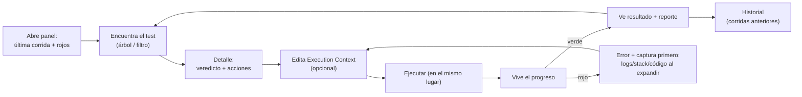
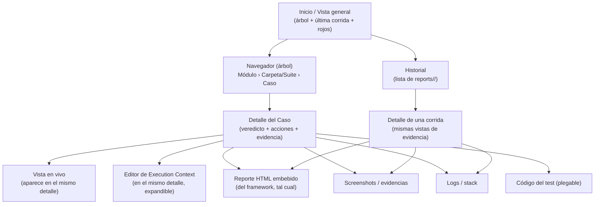

# Panel de Control Web — Diseño de Experiencia (UX)

> **Rol de este documento.** Diseño de la **experiencia de uso** del panel web, no de su interfaz visual. Aquí **no** hay colores, ni componentes, ni HTML, ni layout en píxeles. Hay **flujo, jerarquía de información, revelación progresiva, estados y comportamiento**. Cuando menciono "zonas" (navegador, detalle, vista en vivo) me refiero a *regiones de experiencia por su rol*, nunca a su forma visual.
>
> **Es ADITIVO y no cambia nada.** Se apoya en lo aprobado: [README](../README.md), [Guidelines](../CLAUDE_FRAMEWORK_GUIDELINES.md), [arquitectura de la plataforma](./plataforma-de-control-arquitectura.md) y, sobre todo, [arquitectura del panel mínimo](./panel-de-control-web-arquitectura.md). No modifica el framework ni propone nuevas fuentes de datos: todo lo que la experiencia muestra ya lo genera el framework (`reports/<RUN_ID>/`, `execution-context.json`, el Input Model).
>
> **Alcance (lo que la UX NO debe volverse):** no es TestRail, ni Jenkins, ni Allure. La experiencia debe *sentirse* como un explorador de archivos con un botón de "correr" — simple, predecible, sin curva de aprendizaje. Toda tentación de dashboard/analytics pertenece al documento de la plataforma grande, no aquí.

---

## 0. Índice

- [1. Principios de experiencia](#1-principios-de-experiencia)
- [2. Flujo completo del usuario — un día de trabajo](#2-flujo-completo-del-usuario--un-día-de-trabajo)
- [3. Mapa de navegación](#3-mapa-de-navegación)
- [4. Jerarquía de información](#4-jerarquía-de-información)
- [5. Qué se ve primero](#5-qué-se-ve-primero)
- [6. Qué queda oculto inicialmente](#6-qué-queda-oculto-inicialmente)
- [7. Qué elementos son expandibles](#7-qué-elementos-son-expandibles)
- [8. Qué acciones requieren confirmación](#8-qué-acciones-requieren-confirmación)
- [9. Estados de carga](#9-estados-de-carga)
- [10. Estados vacíos](#10-estados-vacíos)
- [11. Estados de error](#11-estados-de-error)
- [12. Estado: un test ejecutándose](#12-estado-un-test-ejecutándose)
- [13. Estado: un test que termina](#13-estado-un-test-que-termina)
- [14. Riesgos de usabilidad](#14-riesgos-de-usabilidad)
- [15. Posibles mejoras futuras](#15-posibles-mejoras-futuras)
- [16. Recomendaciones](#16-recomendaciones)
- [17. Cierre](#17-cierre)

---

## 1. Principios de experiencia

Estos principios son la vara con la que se justifica cada decisión de abajo.

| # | Principio | Qué evita |
|---|---|---|
| U1 | **No perder el contexto.** Correr un test **no** te saca de donde estás. El árbol sigue visible; la ejecución sucede *en el lugar*, no en otra pantalla. | La desorientación de "¿dónde quedé?" tras cada corrida. |
| U2 | **Verdad primero, detalle después (revelación progresiva).** Lo primero que ves es el *veredicto* y la *acción*; logs, stack, código y galería llegan cuando los pedís. | El muro de información que obliga a leer todo para encontrar lo importante. |
| U3 | **El fallo se entiende de un vistazo.** Un test rojo muestra *primero* qué falló y su captura del momento, no un volcado plano. | Bucear en carpetas y stack traces para reconstruir qué pasó. |
| U4 | **Reconocer, no recordar.** El usuario elige de listas descubiertas (tests, corridas, campos del Input Model); nunca teclea nombres de memoria. | Errores de tipeo y comandos olvidados. |
| U5 | **Cero sorpresas destructivas.** Nada largo, costoso o que sobrescriba ocurre sin una confirmación proporcional. Lo frecuente y barato, sin fricción. | Lanzar "correr todo" por accidente; pisar datos sin querer. |
| U6 | **Reversibilidad y continuidad.** Se puede cancelar lo que corre; lo generado se conserva; el panel recuerda lo último que hiciste. | La sensación de "ya no hay vuelta atrás". |
| U7 | **Simplicidad honesta.** Si el framework no lo genera, el panel no lo muestra. Ningún dato inventado, ninguna métrica de más. | Convertir un explorador en un producto empresarial. |

---

## 2. Flujo completo del usuario — un día de trabajo

Narrativa de referencia (una QA, "Ana", con el módulo Reclutamiento). Cada momento nombra el principio que lo gobierna.

**9:00 — Abre el panel (U1, U6).** No ve una pantalla en blanco: ve el **árbol de módulos** y un resumen breve de **la última corrida** y **qué quedó en rojo**. Sabe en segundos si hay algo que atender.

**9:05 — Busca un test (U4).** Expande `Reclutamiento › Requisiciones` y ve `Crear`, `Publicar`, `Pausar`, `Importar documentos`. Reconoce; no recuerda. (Si el módulo tuviera cientos de casos, usaría un filtro rápido por nombre — ver §14/§15.)

**9:06 — Selecciona "Publicar requisición".** El **detalle** muestra lo esencial: nombre, descripción, **su última ejecución** (verde/rojo/nunca corrido), y los botones **Ejecutar / Ejecutar carpeta / Ejecutar módulo**. Lo demás (logs, código, todas las capturas) está **plegado**.

**9:07 — Ajusta datos (U4).** Abre el editor de **Execution Context**: ve solo los parámetros que ese caso necesita (renderizados desde el Input Model). Deja un campo vacío a propósito (sabe que "vacío ⇒ el framework lo descubre"). Guarda.

**9:08 — Ejecuta (U1).** Aprieta **Ejecutar**. **No cambia de pantalla**: en el mismo detalle aparece la **vista en vivo** — el caso corriendo, líneas de progreso saliendo, un botón **Cancelar**. El árbol sigue ahí.

**9:09 — Falla (U3).** Al terminar, el detalle muestra **primero** el veredicto rojo y el **encabezado del error** ("no se encontró el botón Pausar") con la **captura del momento del fallo**. No tuvo que abrir nada.

**9:10 — Analiza (U2).** Expande el **stack** y el **log**; abre el **código del test** (plegable) para releer el paso. Entiende que era un dato mal puesto.

**9:12 — Corrige y reintenta (U6).** Ajusta el Execution Context y aprieta **Ejecutar** de nuevo — mismo lugar, mismo flujo. Ahora pasa: veredicto verde, captura final, enlace al **reporte**.

**9:20 — Corre la carpeta (U5).** Aprieta **Ejecutar carpeta** (`Requisiciones`). Como son varios y toma más, la vista en vivo muestra **progreso N/total** y qué caso corre. No pidió confirmación porque es acotado; **Ejecutar módulo** o **todos** sí la pedirían.

**12:00 — Smoke antes de almorzar.** Corre el módulo entero; deja la vista en vivo de fondo (un **indicador persistente** le avisa que hay una corrida activa aunque navegue a otro caso).

**17:30 — Revisa el día (U7).** Abre **Historial**: la lista de corridas del día (por su marca de tiempo), cada una con su resumen y enlace a **su** reporte. No hay analítica; hay lo que el framework ya guardó.

---

## 3. Mapa de navegación

La navegación es **plana a propósito** (2–3 niveles). No hay laberinto: casi todo sucede sin cambiar de "lugar".

Reglas de navegación (experiencia):
- **El navegador (árbol) es persistente.** Elegir un caso cambia el *detalle*, no la pantalla. Correr un caso abre la vista en vivo *dentro* del detalle. (U1)
- **Todo destino de evidencia** (reporte, screenshots, logs, código) es un **sub-nivel del caso o de la corrida**, no una sección aparte. Se llega y se vuelve con un gesto.
- **Historial** es la única "otra vista", y desemboca en las **mismas** vistas de evidencia (no hay dos formas distintas de ver un screenshot).
- **Sin rutas profundas ni migas de pan largas:** como máximo Inicio → Caso → (evidencia), o Inicio → Historial → Corrida → (evidencia).

---

## 4. Jerarquía de información

De lo más importante (siempre visible) a lo más profundo (bajo demanda):

| Nivel | Qué vive acá | Por qué en este nivel |
|---|---|---|
| **N0 — Orientación** | Módulos disponibles; última corrida; qué está en rojo. | Responde "¿dónde estoy y hay algo urgente?" al abrir. |
| **N1 — Identidad y acción del caso** | Nombre, descripción, **veredicto de la última ejecución**, botones **Ejecutar / carpeta / módulo**. | Es el 90% de la interacción: elegir y correr. |
| **N2 — Evidencia esencial del último resultado** | Si falló: encabezado del error + captura del fallo. Si pasó: captura final + enlace al reporte. | Entender el resultado *sin* abrir nada (U3). |
| **N3 — Detalle bajo demanda (expandible)** | Log completo, stack, **todas** las capturas, código del test, reporte HTML embebido, Execution Context extenso. | Necesario a veces, ruidoso siempre-visible (U2). |
| **N4 — Profundidad histórica** | Corridas anteriores y su evidencia. | Se consulta puntualmente, no en el flujo principal. |

**Principio rector:** cuanto más frecuente y decisiva es una información, más arriba y más siempre-visible está. La acción de correr y el veredicto nunca se esconden; los logs casi siempre sí.

---

## 5. Qué se ve primero

**Al abrir el panel:** el **árbol de módulos** y una franja de **estado reciente** (última corrida + casos en rojo). Nada más compite por la atención.

**Al seleccionar un caso, en orden de lectura:**
1. **Nombre y descripción** (identidad).
2. **Veredicto de la última ejecución**: verde / rojo / **nunca ejecutado** (los tres estados son explícitos; "nunca ejecutado" no es un error).
3. **Acción primaria: Ejecutar** (y, secundarias, carpeta/módulo).
4. **Solo si el último resultado fue rojo:** el **encabezado del error** y la **captura del momento del fallo**. (U3)
5. **Un acceso claro** a "ver reporte", "screenshots", "logs", "código", "editar contexto" — visibles como puertas, pero **cerradas** (plegadas).

**Justificación:** el usuario que abre un caso casi siempre quiere una de dos cosas: *correrlo* o *entender por qué falló*. Ambas quedan resueltas en el primer vistazo; todo lo demás espera un clic.

---

## 6. Qué queda oculto inicialmente

Oculto (plegado) por defecto, para no ahogar el flujo principal:
- **Log completo** y **stack trace** completo (se ve el encabezado del error; el resto se expande).
- **Galería completa de screenshots** (se ve la captura del fallo o la final; el resto se expande).
- **Código fuente del test** (plegable, solo lectura).
- **Reporte HTML embebido** (se ofrece "abrir reporte"; no se incrusta hasta pedirlo — es pesado).
- **Execution Context avanzado:** en casos de formulario con muchos campos, los que están vacíos/menos usados quedan agrupados y plegados; los que el usuario ya llenó o son requeridos, visibles.
- **Corridas anteriores** (Historial es una vista aparte; no invade el detalle del caso).
- **La consola en vivo detallada** cuando no hay nada corriendo.

**Regla:** ocultar ≠ esconder. Cada elemento oculto tiene una **puerta visible y rotulada** ("Ver log", "Ver código", "12 capturas"). El usuario siempre sabe que existe y cómo abrirlo. (U2)

---

## 7. Qué elementos son expandibles

Todo lo del N3 se expande/colapsa en el mismo lugar, sin navegar:
- **Código del test** — colapsable (requisito explícito).
- **Log de ejecución** — colapsable, y al expandirse, filtrable/buscable por texto.
- **Stack trace** — colapsable bajo el encabezado del error.
- **Galería de screenshots/evidencias** — colapsada a la captura clave; expande a todas, en orden temporal, con su etiqueta (`label`).
- **Execution Context** — el editor completo se expande; dentro, los grupos de campos de formulario se expanden por sección.
- **Filas del Historial** — cada corrida expande a su resumen y sus enlaces de evidencia.
- **Reporte HTML** — se expande/incrusta bajo demanda (o abre en pestaña, a elección del usuario).

**Estado de expansión con memoria (recomendado):** si el usuario dejó el log abierto, al volver a otro caso conviene recordar esa preferencia de "detalle abierto/cerrado" durante la sesión. Reduce el reabrir repetitivo. (U6)

---

## 8. Qué acciones requieren confirmación

La confirmación es **proporcional al costo/irreversibilidad** (U5). Confirmar de más entrena a la gente a apretar "sí" sin leer; confirmar de menos causa accidentes.

| Acción | ¿Confirma? | Por qué |
|---|---|---|
| **Ejecutar un test** | **No** | Frecuente y acotado; pedir confirmación sería fricción diaria. |
| **Ejecutar carpeta** | **No** (pero avisa cuántos casos) | Acotado; mostrar "vas a correr N casos" alcanza. |
| **Ejecutar módulo** | **Sí, leve** | Puede ser largo y abrir muchas ventanas de navegador; confirmación breve con el nº de casos. |
| **Ejecutar TODOS los tests** | **Sí, explícita** | Larga, costosa, muchas corridas; la más fácil de disparar por error. Debe requerir un "sí" consciente. |
| **Cancelar una corrida en curso** | **Sí, leve** | Es reversible (se puede volver a correr) pero interrumpe trabajo; confirmar evita el cancel accidental. Lo ya generado se conserva y se dice. |
| **Guardar Execution Context que se editó** | **No**, salvo conflicto | Guardar es normal; pero **si el archivo cambió en disco desde que se cargó** (lo editaste a mano en paralelo), pedir confirmación para no pisar. |
| **Salir/cerrar con una corrida activa** | **Sí** | Avisar que hay algo corriendo antes de perder la vista en vivo. |

**Principio:** la confirmación explica **la consecuencia concreta** ("vas a correr 47 casos, puede tardar varios minutos"), no un genérico "¿Estás seguro?".

---

## 9. Estados de carga

Cada espera se comunica, y cada una tiene su forma según cuánto dura (U2, U7):

- **Descubriendo el árbol** (al abrir): rápido; indicador sutil. Si tarda, mensaje "buscando tests…". Nunca un árbol vacío ambiguo mientras carga.
- **Cargando el detalle / última ejecución de un caso** (lee `reports/`): indicador local en el detalle, sin bloquear el árbol.
- **Abriendo el reporte HTML** (pesado): indicador claro "cargando reporte…", porque puede tardar; se permite seguir usando el resto.
- **Guardando el Execution Context**: indicador breve + confirmación de guardado ("guardado") para que el usuario sepa que quedó.
- **Arrancando una corrida** (entre apretar Ejecutar y ver la primera línea): un estado **"iniciando…"** explícito, porque hay un lapso (levantar el proceso/navegador) en el que "no pasa nada" y el usuario podría creer que no funcionó.

**Regla:** ningún estado de carga debe parecer un estado vacío o un error. La diferencia entre "cargando", "vacío" y "roto" siempre es explícita.

---

## 10. Estados vacíos

Los vacíos son oportunidades de orientar, no callejones (U7):

| Vacío | Mensaje/experiencia |
|---|---|
| **Ningún módulo descubierto** | "No se encontraron módulos con tests." + pista de dónde los busca (workspaces con `tests/`). No es un error: puede ser un proyecto recién iniciado. |
| **Módulo sin casos** | "Este módulo aún no tiene tests." Neutral. |
| **Caso nunca ejecutado** | **Estado propio, distinto de rojo:** "Sin ejecuciones todavía." + botón Ejecutar destacado. Es el estado normal de un test nuevo recién descubierto. |
| **Corrida sin screenshots/evidencias** | "Sin capturas para esta corrida" (p. ej. pasó en modo `SCREENSHOT_MODE=none`). Explica el porqué si se puede. |
| **Execution Context sin parámetros editables** | Para un caso sin formulario y sin parámetros: "Este caso no requiere datos de entrada." No un formulario vacío desconcertante. |
| **Historial vacío** | "Todavía no hay ejecuciones registradas." + invitación a correr algo. |

**Principio:** un vacío **explica por qué está vacío** y **ofrece la siguiente acción**. Nunca un espacio en blanco mudo.

---

## 11. Estados de error

La UX distingue con cuidado **tipos de "rojo"**, porque el usuario reacciona distinto a cada uno (U3):

| Tipo de error | Cómo se comunica | Acción sugerida |
|---|---|---|
| **Test que falla** (la app se probó y no cumplió) | Veredicto rojo + encabezado del error + captura del fallo. Es el "rojo bueno": el test hizo su trabajo. | Analizar (logs/stack/código), ajustar datos, reintentar. |
| **La corrida no pudo arrancar** (comando falló: `npm` no está, ruta mala, proceso murió al inicio) | **Mensaje distinto y claro:** "No se pudo iniciar la ejecución" + la salida cruda del intento. Se aclara que **no es un fallo del test**. | Revisar entorno/instalación; reintentar. |
| **El test crashea a mitad** (el navegador se cae, timeout duro) | Se distingue de "falló una aserción": "La ejecución se interrumpió." + lo que alcanzó a generar. | Reintentar; si persiste, revisar entorno. |
| **No hay resultado / reporte** (terminó pero falta `results.json` o el HTML) | "No se encontró el resultado de esta corrida." Sin romper la vista; ofrece ver logs crudos. | Ver logs; reintentar. |
| **Conflicto al guardar contexto** (cambió en disco) | "El archivo de datos cambió por fuera; ¿sobrescribir o recargar?" | Elegir conscientemente (U5). |
| **Artefacto faltante** (un screenshot referenciado no está) | Marcador discreto "captura no disponible", sin romper la galería. | — |

**Principios de error:**
- **Nunca un error genérico opaco.** Siempre: qué pasó, si es del test o del entorno, y qué se puede hacer.
- **El error del entorno se separa del error del test.** Confundirlos hace perder tiempo buscando en el lugar equivocado.
- **El fallo nunca destruye el contexto:** el árbol y el caso siguen ahí; se puede reintentar en el acto.

---

## 12. Estado: un test ejecutándose

Aparece **en el mismo detalle**, sin sacar al usuario de su lugar (U1). La experiencia comunica *movimiento y control*:

- **Fase "iniciando…"** explícita (el lapso antes de la primera línea), para que nunca parezca colgado.
- **Progreso vivo:** las líneas de salida aparecen a medida que ocurren; en corridas de varios casos, **N/total**, **caso actual resaltado**, y **tiempo transcurrido** (y, si hay promedio histórico, un ETA aproximado — mejora, §15).
- **Control siempre presente:** botón **Cancelar** visible durante toda la corrida.
- **Continuidad:** el usuario puede **navegar a otro caso** mientras corre; un **indicador persistente** ("1 corrida en curso") lo mantiene informado y le permite volver a la vista en vivo con un gesto. (U1, U6)
- **Bloqueos sensatos:** mientras un caso corre, su botón Ejecutar se muestra como "en curso" (no permite dispararlo dos veces por accidente), pero el resto del panel sigue usable.
- **Sin falsa precisión:** si no hay datos para un ETA confiable, se muestra tiempo transcurrido, no una barra que miente.

**Justificación:** la peor experiencia al ejecutar es la duda ("¿está corriendo o se colgó?"). El estado en vivo elimina esa duda con señales constantes y un cancelar siempre a mano.

---

## 13. Estado: un test que termina

La transición de "corriendo" a "terminado" debe ser **inequívoca** y **útil de inmediato** (U3):

- **El veredicto reemplaza al progreso en el acto:** verde/rojo, con el tiempo total. No hay que ir a buscarlo.
- **Si pasó:** captura final + enlace al **reporte**, y **Ejecutar** listo para repetir. Un cierre tranquilo.
- **Si falló:** salta al modo de §11 — encabezado del error + captura del fallo primero; logs/stack/código a un clic.
- **La evidencia queda enganchada al caso:** la "última ejecución" del caso ahora es esta corrida; el Historial ganó una entrada. Sin pasos manuales.
- **Aviso si el usuario estaba en otro lado:** si navegó a otro caso, el indicador persistente cambia a "corrida terminada — ver resultado", para que no se pierda el desenlace. (U6)
- **Cancelada:** estado propio ("Cancelada"), distinto de pasó/falló, aclarando que **lo ya ejecutado se conservó**.

**Principio:** terminar es un momento de decisión (¿lo doy por bueno? ¿lo depuro? ¿lo repito?). La UX pone esas tres salidas al alcance sin navegación.

---

## 14. Riesgos de usabilidad

| Riesgo | Impacto | Mitigación de experiencia |
|---|---|---|
| **El árbol se vuelve inmanejable** con muchos casos (decenas por módulo). | Alto a escala | Filtro rápido por nombre (reconocer, no scrollear), agrupación por carpeta/prefijo, colapso por defecto de módulos que no se están usando. (§15) |
| **Confundir "test falló" con "no arrancó".** | Alto | Separación explícita de ambos estados (§11); es el error de UX más caro si se ignora. |
| **"Ejecutar todos" disparado por accidente.** | Alto | Confirmación explícita con consecuencia concreta (§8). |
| **Creer que se colgó** durante el lapso de arranque. | Medio | Estado "iniciando…" explícito (§9, §12). |
| **Pisar datos del `execution-context.json`** editados a mano en paralelo. | Medio | Detección de conflicto al guardar (§8, §11). |
| **Sobrecarga informativa** si se muestra todo de una. | Medio | Revelación progresiva estricta (§6); el detalle abre "verdad primero". |
| **Perder el desenlace** de una corrida al navegar. | Medio | Indicador persistente + aviso al terminar (§12, §13). |
| **Inconsistencia entre lo que el panel muestra y el estado real** (alguien corrió por consola en paralelo). | Bajo/Medio | El panel siempre lee de `reports/` en vivo; ofrecer "refrescar" y mostrar la marca de tiempo de lo que se ve. |
| **Deriva de alcance** (que el equipo pida analítica y el panel se vuelva un Allure). | Estratégico | Mantener el foco: "ejecutar y ver". Lo demás va al doc de la plataforma. (U7) |
| **Reporte HTML embebido pesado** que traba la experiencia. | Bajo/Medio | Cargarlo bajo demanda; permitir abrir en pestaña en vez de incrustar. |

---

## 15. Posibles mejoras futuras

Todas **aditivas**, fuera de la versión mínima, sin rediseñar lo anterior:
- **Filtro/búsqueda por nombre** en el árbol (se vuelve necesario al crecer el nº de casos; hoy no).
- **"Correr como la última vez"** — repetir un caso con su último Execution Context sin reconfigurar.
- **Indicador de últimos tocados / recientes** para retomar el trabajo del día.
- **ETA confiable** basado en el tiempo histórico de cada caso (leyendo las corridas anteriores).
- **Diff "¿qué cambió respecto de la última vez verde?"** al ver un fallo (la mejora de mayor valor del doc de experiencia de la plataforma; aquí, opcional).
- **Vivo de alta fidelidad** (paso a paso, captura a captura) cuando exista el reporter de eventos.
- **Marcar favoritos** los casos que más se corren.
- **Recordatorio de datos vacíos** antes de correr un caso de formulario, si el usuario suele completarlos.

Cada una es un peldaño hacia la plataforma grande; la experiencia mínima es utilizable y valiosa sin ninguna de ellas.

---

## 16. Recomendaciones

1. **Diseñar el detalle del caso con la regla "verdad primero".** Veredicto y acción arriba; logs/stack/código/galería plegados con puertas rotuladas. Es la decisión de UX de mayor impacto diario.
2. **Separar visual y textualmente "test falló" de "no se pudo ejecutar".** Es el malentendido más caro; resolverlo temprano ahorra horas de soporte.
3. **Ejecutar en el mismo lugar, nunca navegando afuera.** Preservar el contexto (árbol + caso) es lo que hace que el panel se sienta simple.
4. **Confirmaciones proporcionales, con consecuencia concreta.** Sin confirmación para lo frecuente; explícita para "todos"; nunca un "¿estás seguro?" hueco.
5. **Tratar "nunca ejecutado" y cada estado vacío como estados de primera clase**, con mensaje y próxima acción — no como ausencias mudas.
6. **Un indicador de corrida persistente** que sobreviva a la navegación y avise el desenlace.
7. **No incrustar el reporte pesado por defecto;** ofrecerlo bajo demanda o en pestaña.
8. **Resistir la deriva de alcance.** Cada vez que alguien pida "una métrica más", recordar que eso vive en el documento de la plataforma; el panel es "ejecutar y ver".
9. **Prever el crecimiento del árbol** dejando lugar conceptual para un filtro por nombre, aunque no se implemente en la v1.
10. **Comunicar siempre la frescura de lo que se ve** (marca de tiempo + refrescar), porque el usuario también corre por consola en paralelo.

---

## 17. Cierre

La experiencia del panel se sostiene en una idea: **que ejecutar un test y entender su resultado no cueste más que abrir un archivo y leerlo.** El usuario nunca pierde el contexto, ve la verdad antes que el detalle, distingue un fallo del test de un problema del entorno, y tiene siempre a mano las tres salidas de todo resultado: darlo por bueno, depurarlo o repetirlo. Todo lo que se muestra ya lo produce el framework; la UX solo decide **el orden en que aparece, qué se revela cuándo, y cómo se comunica cada estado**. Se mantiene, deliberadamente, del lado de "explorador de archivos con un botón de correr" — y todo lo que empuje hacia un producto empresarial se remite, por diseño, al documento de la plataforma.
