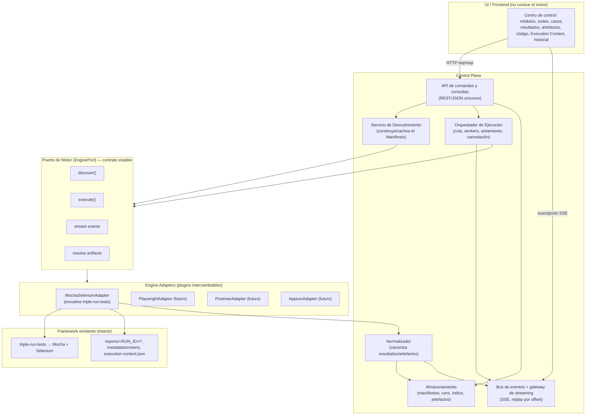
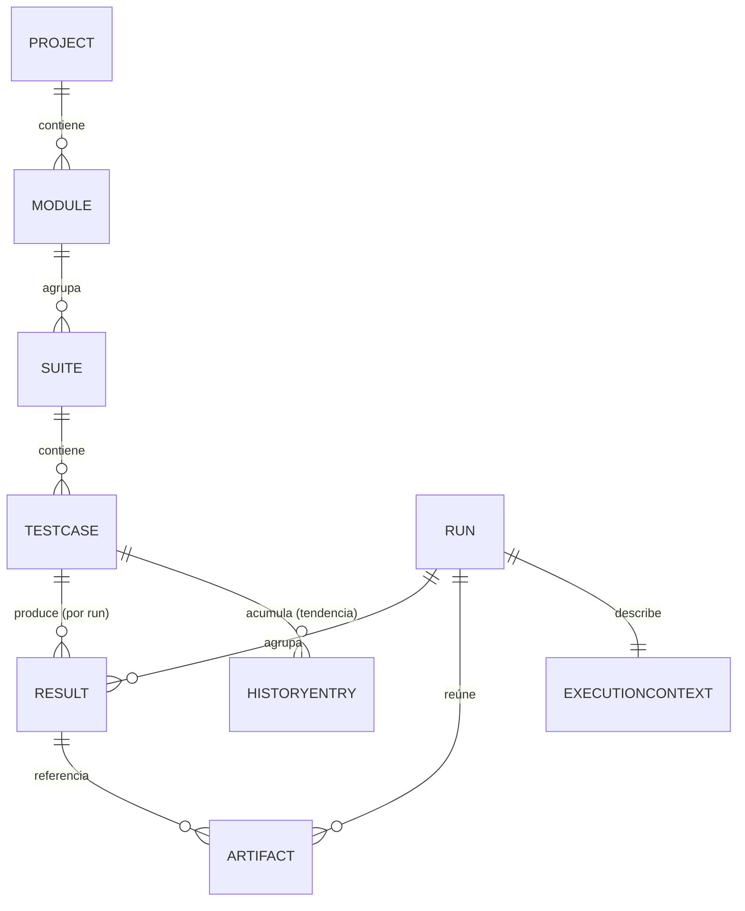
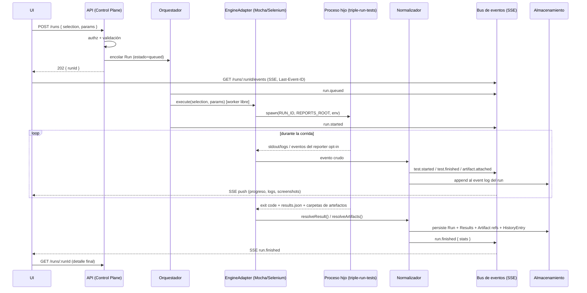
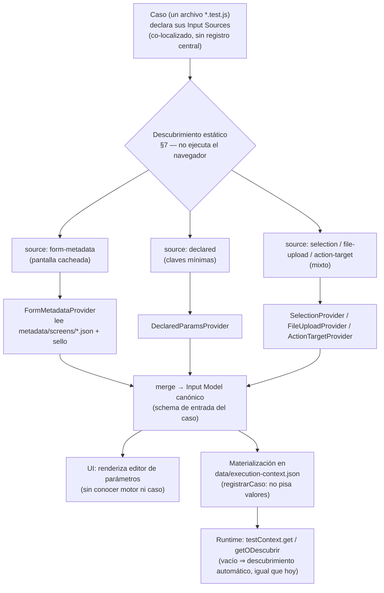
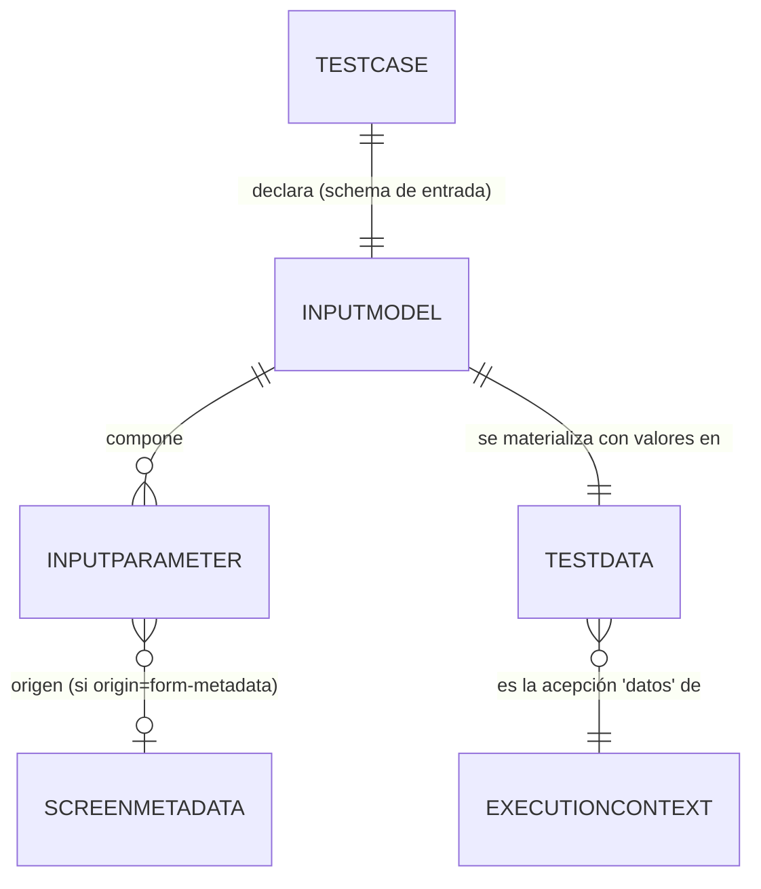

# Plataforma de Control del Framework — Diseño Arquitectónico

> Documento de **diseño**, no de implementación. No contiene código de producción: usa diagramas conceptuales (mermaid) y formas de payload solo como ilustración de contratos. El foco es la **justificación** de cada decisión y las **alternativas descartadas**.
>
> Autor: Arquitectura de plataformas de automatización de pruebas.
> Estado: propuesta para revisión.
> Alcance: convertir el framework `@triple/core` (Selenium + Mocha + Mochawesome, monorepo npm workspaces) en un **control plane** desacoplado del motor de ejecución, con descubrimiento automático, ejecución bajo demanda, resultados/artefactos en vivo e historial.

---

## 0. Índice

1. [Resumen ejecutivo](#1-resumen-ejecutivo)
2. [Grounding: qué existe hoy y qué falta](#2-grounding-qué-existe-hoy-y-qué-falta)
3. [Principios rectores y cómo el diseño los respeta](#3-principios-rectores-y-cómo-el-diseño-los-respeta)
4. [Arquitectura general](#4-arquitectura-general)
5. [Modelo de dominio normalizado e independiente del motor](#5-modelo-de-dominio-normalizado-e-independiente-del-motor)
6. [Cómo se logra la independencia del motor](#6-cómo-se-logra-la-independencia-del-motor)
7. [Cómo se logra el descubrimiento automático](#7-cómo-se-logra-el-descubrimiento-automático)
8. [Ejecución](#8-ejecución)
9. [Comunicación entre componentes](#9-comunicación-entre-componentes)
10. [Sincronización y estado en vivo](#10-sincronización-y-estado-en-vivo)
11. [Almacenamiento](#11-almacenamiento)
12. [Escalabilidad](#12-escalabilidad)
13. [Patrones arquitectónicos aplicados](#13-patrones-arquitectónicos-aplicados)
14. [Seguridad](#14-seguridad)
15. [Mantenibilidad](#15-mantenibilidad)
16. [Riesgos y decisiones abiertas](#16-riesgos-y-decisiones-abiertas)
17. [Hoja de ruta por fases](#17-hoja-de-ruta-por-fases)
18. [Generación del Execution Context según el tipo de caso](#18-generación-del-execution-context-según-el-tipo-de-caso)

---

## 1. Resumen ejecutivo

El framework actual ya tiene, sin saberlo, la mitad de un control plane: **describe su propio trabajo por convención** (un caso = un archivo `*.test.js`, un nombre descriptivo como fuente única de verdad que atraviesa test, Execution Context, evidencias y screenshots), **persiste metadata estructurada** (pantallas autogestionadas con sello de versión/firma, `execution-context.json` por módulo), **orquesta corridas con identidad estable** (`RUN_ID` por timestamp, carpetas `reports/<RUN_ID>/` con retención `KEEP_REPORTS`) y **emite resultados en formato máquina** (`results.json` de Mochawesome con estadísticas, estados, duraciones, contexto y evidencias embebidas). Lo que falta no es información: es una **capa que la lea, la normalice y la exponga** sin acoplarse a Selenium ni a Mocha.

La propuesta es una arquitectura **Ports & Adapters (hexagonal)** en tres fronteras duras: (1) una **UI** que solo consume un modelo canónico y nunca conoce el motor; (2) un **Control Plane** (API + orquestador + almacenamiento + bus de eventos) que razona exclusivamente sobre entidades canónicas (`Module`, `Suite`, `TestCase`, `Run`, `Result`, `Artifact`, `ExecutionContext`, `HistoryEntry`); y (3) **Engine Adapters** intercambiables que traducen el mundo de cada motor (Mocha/Selenium hoy; Playwright, Cypress, Appium, Postman mañana) a ese modelo canónico. El motor vive detrás de un **puerto** con cuatro capacidades: **descubrir**, **ejecutar**, **emitir eventos** y **exponer artefactos**.

El **descubrimiento automático** se resuelve produciendo un **Manifiesto de Descubrimiento** normalizado: cada adaptador enumera módulos/suites/casos desde su propia convención (para Mocha, la estructura de workspaces + archivos + nombres de caso + secciones del Execution Context + metadata de pantallas, sin ejecutar el navegador) y el Control Plane lo cachea con invalidación por huella de filesystem (mtimes/hash), del mismo modo que la metadata de pantallas ya se autoinvalida por sello. La UI **solo representa** ese manifiesto; agregar un caso es crear un archivo, no registrar nada.

La **comunicación** combina lo síncrono para comandos y consultas (REST/JSON: descubrir, disparar, listar, leer artefactos) con lo asíncrono para el vivo (un flujo de **eventos de dominio** — `run.started`, `test.started`, `test.finished`, `artifact.attached`, `run.finished` — servido por SSE, con reconexión y *replay* desde un offset). El estado en vivo es un **event log por corrida**: la fuente de verdad del progreso, que permite que múltiples clientes vean la misma corrida de forma consistente y que un cliente que se reconecta reconstruya el estado sin lagunas.

Las decisiones se toman siempre a favor de la filosofía del framework: **aditivo y desacoplado**. El control plane **no modifica** el core ni los casos; se apoya en los artefactos que el framework ya produce y en un adaptador que envuelve el binario `triple-run-tests` existente. Un motor nuevo se agrega escribiendo un adaptador que cumpla el puerto — sin tocar la UI ni el core de casos.

---

## 2. Grounding: qué existe hoy y qué falta

Esta sección ancla el diseño en el repositorio real. No se diseña en abstracto: se diseña **sobre** lo que el framework ya hace.

### 2.1. Activos existentes reutilizables como fuente de verdad

| Activo existente | Archivo / mecanismo | Rol en el control plane |
|---|---|---|
| **Módulos** | Workspaces del `package.json` raíz (`core`, `reclutamiento`, …) | Enumeración de `Module` sin registro manual |
| **Casos** | Convención `"<módulo>/tests/<nombre-descriptivo>.test.js"`, un caso por archivo | Enumeración de `TestCase`; el path del archivo es un identificador natural |
| **Nombre de caso** | Constante `CASO` reutilizada en el título del `it`, en las secciones del Execution Context, en carpetas de evidencias/screenshots | **Clave de correlación canónica** que une código ↔ datos ↔ resultados ↔ artefactos |
| **Datos de prueba** | `data/execution-context.json` + `testContext.registrarCaso()` (siembra secciones vacías al implementar el caso) | Fuente de los parámetros por caso; base para "editar datos desde la UI" |
| **Metadata de pantallas** | `metadata/screens/<pantalla>.json` con sello `{ version, firma }`, `screenMetadata.listar()`, autoinvalidación | Modelo de *self-description* ya probado; patrón a imitar para invalidar el manifiesto |
| **Corridas** | `RUN_ID` (`YYYY-MM-DD_HH-mm-ss`), `paths.listRuns()`, `getRunPaths()`, `reports/<RUN_ID>/{html,json,screenshots,logs,evidence}` | Identidad e historial de `Run`; ya hay orden cronológico y layout de artefactos |
| **Resultados** | `results.json` de Mochawesome: `stats` (suites/tests/passes/failures/duration/start/end), `results[].tests[]` (`title`, `fullTitle`, `state`, `duration`, `context`, `err`, `code`) | Fuente directa para normalizar `Result`; `code` da el **código del test** para "ver el código" |
| **Evidencias** | `evidence.js` con tipos `image/video/pdf/download/log/json/html/text`, agrupadas por test | Catálogo de `Artifact`; ya hay tipado y ubicación en disco |
| **Contexto de ejecución (reporte)** | `utils/executionContext.js` (ambiente, SO, navegador, usuario, timezone, `runId`) | Metadata de `Run` para el header de la UI |
| **Orquestación** | Bin `triple-run-tests` (`scripts/run-tests.js`): `spawn` de Mocha como proceso hijo, `RUN_ID`/`REPORTS_ROOT` por env, `--require mochaRootHooks`, `--reporter mochawesome`, exit code para CI, retención | **Punto de integración**: el adaptador Mocha envuelve este binario sin reescribirlo |
| **Config por corrida** | Env vars (`SCREENSHOT_MODE`, `HEADLESS`, `KEEP_REPORTS`, `TEST_RETRIES`, …) leídas en `config/index.js` | Parámetros de ejecución que la UI puede setear por corrida sin tocar `.env` |
| **Logging** | `logger.js` → `reports/<RUN_ID>/logs/execution.log` + `run-stdout.log` | Fuente de logs para el visor; y stream para el vivo |

### 2.2. Qué falta (el delta que este diseño cubre)

1. **Un modelo canónico** independiente del motor. Hoy la "verdad" está dispersa en convenciones y en el formato de Mochawesome (acoplado a Mocha).
2. **Un manifiesto de descubrimiento** que enumere módulos/suites/casos + metadata en una forma estable, sin ejecutar el navegador, y que se **invalide** cuando cambian los archivos.
3. **Un puerto de motor** (contrato) y un **adaptador** que envuelva `triple-run-tests` y traduzca `results.json`/logs/evidencias al modelo canónico.
4. **Una API de control plane** (comandos + consultas) y un **bus de eventos** para el vivo.
5. **Streaming de progreso en vivo**: hoy `results.json` se escribe **al final**; falta emitir eventos **durante** la corrida.
6. **Una UI** que represente todo lo anterior.
7. **Un índice/historial consultable** que no dependa de recorrer el filesystem en cada request (opcional en fases tempranas, necesario al escalar).

### 2.3. Restricción de diseño derivada del grounding

- El core y los casos **no se tocan**. El control plane es *aditivo*: vive en un workspace nuevo (p. ej. `control-plane/`) y consume artefactos existentes.
- El único punto donde conviene una **extensión opt-in** del framework es la **emisión de eventos en vivo** (ver §8.4): un reporter/hook adicional que no cambia el comportamiento actual y que, si no está presente, degrada elegantemente a *polling* del `results.json`.

---

## 3. Principios rectores y cómo el diseño los respeta

| Principio (del enunciado) | Mecanismo de diseño | Sección |
|---|---|---|
| **Independencia del motor** | Puerto `EnginePort` (Ports & Adapters). El control plane depende de la interfaz, no de Selenium/Mocha. | §6 |
| **UI desacoplada del motor** | La UI solo consume el modelo canónico vía API/eventos. No importa ningún SDK de motor. Frontera dura UI ↔ Control Plane. | §4, §9 |
| **Framework auto-descriptivo** | Manifiesto de Descubrimiento generado por convención (sin registro manual), invalidado por huella de filesystem. La UI **representa**, no registra. | §7 |
| **Aditivo y desacoplado** | El control plane es un workspace nuevo; envuelve `triple-run-tests`; no modifica core ni casos; los motores se agregan como plugins. | §2.3, §13, §15 |

Estos cuatro principios son **invariantes de arquitectura**: cualquier decisión posterior que los viole se descarta, y así se justifica cada trade-off.

---

## 4. Arquitectura general

### 4.1. Capas y componentes lógicos



**Responsabilidades y por qué viven donde viven:**

- **UI**: pura representación. Se ubica *fuera* de toda decisión de motor porque el principio 2 lo exige; si mañana el control plane cambia de motor, la UI no se entera. Consume dos superficies: API (consultas/comandos) y stream de eventos (vivo).
- **API (comandos + consultas)**: la única puerta de entrada síncrona. Aloja aquí la autorización (§14) porque es el punto de estrangulamiento natural. Separa **comandos** (disparar corrida, cancelar, editar datos) de **consultas** (listar módulos, leer un run) — una separación estilo CQRS ligera (§13) justificada por sus perfiles distintos: los comandos mutan y auditan; las consultas son cacheables y de solo lectura.
- **Servicio de Descubrimiento**: construye el Manifiesto invocando `discover()` en los adaptadores. Vive en el control plane, no en la UI, porque el manifiesto es **compartido** por todos los clientes y debe cachearse/invalidarse una sola vez.
- **Orquestador**: gobierna el ciclo de vida de una `Run` (encolar → aislar → ejecutar → cancelar/timeout → cerrar). Aislado del motor: le pide al puerto `execute()` y consume su stream. Aquí viven cola, paralelismo y política de aislamiento (§8).
- **Normalizador**: traduce la salida cruda de cada adaptador a entidades canónicas y persiste + emite eventos. Es el *guardián del modelo canónico*: ningún formato específico de motor lo cruza.
- **Bus de eventos + gateway de streaming**: recibe los eventos de dominio (del orquestador y del normalizador) y los reparte a los clientes suscritos, con *replay* para reconexión.
- **Almacenamiento**: manifiestos, índice de historial, punteros a artefactos. Los artefactos binarios **no** se copian: se sirven desde donde el framework ya los deja (§11).
- **Puerto + Adaptadores**: la frontera de motor (§6).

### 4.2. Por qué monolito modular y no microservicios (de entrada)

**Decisión:** el control plane es un **único servicio Node.js** (nuevo workspace del monorepo) con módulos internos bien separados por interfaz, ejecutable en la máquina local del QA.

**Justificación:** el punto de partida real es *una máquina local corriendo Selenium+Chrome*. Un microservicio por responsabilidad introduciría operación distribuida (descubrimiento de servicios, despliegue, red) sin ningún beneficio a esta escala, y chocaría con la filosofía "aditivo y simple". Los límites internos (puerto de motor, normalizador, store) son **costuras** que permiten extraer un componente a proceso/servicio propio cuando la escala lo pida (§12), sin rediseño.

**Alternativa descartada — microservicios desde el día 1:** sobre-ingeniería para el escenario local; multiplica superficie de fallo y de despliegue. Se descarta hasta que exista un ejecutor remoto real.

**Alternativa descartada — todo dentro del proceso de Mocha (un reporter que además sirve la UI):** ataría para siempre la UI al ciclo de vida de una corrida Mocha y violaría los principios 1 y 2. Se descarta.

---

## 5. Modelo de dominio normalizado e independiente del motor

Esta normalización **es** el desacople. Todo lo que el control plane y la UI conocen son estas entidades; cada motor las *mapea* desde su mundo. Se presentan como **contrato conceptual** (formas ilustrativas, no esquemas de implementación).

### 5.1. Entidades canónicas



**Definiciones (contrato estable):**

- **Project / Module** — un *Module* es una unidad de organización descubrible (hoy mapea 1:1 con un workspace: `reclutamiento`). *Project* es el paraguas multi-proyecto/tenant (§12). Campos canónicos: `id`, `nombre`, `engineId`, `descubiertoEn`, `stats` agregadas.
- **Suite** — agrupación intermedia dentro de un módulo. En Mocha mapea al `describe`; en Playwright a un archivo `spec`; en Postman a una carpeta de colección. Es **opcional** en motores que no la tengan (se sintetiza una suite por defecto). Justificación de que sea opcional: no todos los motores tienen dos niveles; forzarla acoplaría el modelo a Mocha.
- **TestCase** — la unidad atómica ejecutable. Campos canónicos: `id` (estable, derivado del nombre descriptivo del caso — no del path, que puede moverse), `nombre` (el `CASO`), `titulo` (el título del `it`), `moduleId`, `suiteId`, `sourceRef` (puntero al archivo + rango para "ver el código"), `parametros` (referencia a la sección del Execution Context), `tags`, `engineId`.
  - **Decisión clave:** el `id` canónico se deriva del **nombre descriptivo del caso**, que el framework ya trata como *fuente única de verdad*. Así el historial de un caso sobrevive a que se renombre o mueva el archivo, y correlaciona código ↔ datos ↔ resultados ↔ evidencias exactamente como ya lo hace el framework por convención.
- **Run / Execution** — una invocación concreta. Campos: `runId` (se reutiliza el `RUN_ID` timestamp existente como identidad), `projectId`, `seleccion` (qué se pidió correr: módulo/suite/caso/glob), `engineId`, `estado` (`queued|running|passed|failed|cancelled|error`), `params` (SCREENSHOT_MODE, HEADLESS, retries…), `triggeredBy` (usuario), `startedAt`, `finishedAt`, `stats`.
- **Result** — el desenlace de un `TestCase` en un `Run`. Campos: `runId`, `testCaseId`, `estado` (`passed|failed|pending|skipped`), `duracionMs`, `error` (mensaje + stack normalizados), `artifactRefs`. Mapea desde `results[].tests[]` de Mochawesome.
- **Artifact** — evidencia tipada. Campos: `id`, `runId`, `testCaseId?`, `tipo` (`screenshot|video|log|json|pdf|html|text|report`), `mime`, `uri` (puntero servible; **no** el binario), `label`, `bytes`, `creadoEn`. Mapea desde `evidence.js` + `screenshots/` + `logs/`.
- **ExecutionContext** — dos acepciones distintas que el framework **ya** separa y que el modelo mantiene separadas para no confundirlas:
  - *Run metadata* (ambiente, SO, navegador, usuario, timezone) ← `utils/executionContext.js`.
  - *Test data* (parámetros por caso) ← `context/testContext.js` + `data/execution-context.json`.
  El modelo canónico las expone como `RunEnvironment` y `TestData` respectivamente. Justificación: fusionarlas reintroduciría el bug conceptual que el README advierte explícitamente.
- **HistoryEntry** — una entrada append-only de la tendencia de un caso o un módulo (estado + duración + runId + timestamp). Es una **proyección** derivada de los `Result`, materializada para responder "historial" y "flakiness" sin recorrer todos los runs (§11).

### 5.2. Por qué normalizar (y no exponer Mochawesome directo)

**Decisión:** el control plane nunca expone `results.json` crudo a la UI; siempre lo pasa por el Normalizador.

**Justificación:** exponer el formato del motor a la UI ata la UI a Mocha — viola los principios 1 y 2. El día que entre Playwright, la UI tendría que entender *dos* formatos. Con un modelo canónico, la UI entiende **uno** para siempre, y la deuda de traducción queda encapsulada en cada adaptador (donde corresponde: quien conoce el motor).

**Alternativa descartada — "formato pasarela" (exponer el JSON del motor con un campo `engineType`):** traslada la complejidad de N formatos a la UI y a cada consumidor futuro (CI, notificaciones). Se descarta: la normalización debe ocurrir una sola vez, del lado del que conoce el motor.

**Alternativa descartada — un modelo por motor con superclase:** genera herencia frágil y filtraciones de detalles de motor hacia arriba. Se descarta a favor de un modelo **plano y estable** + mapeo explícito en cada adaptador.

---

## 6. Cómo se logra la independencia del motor

### 6.1. El puerto `EnginePort` (contrato que todo adaptador cumple)

El motor vive detrás de **un puerto con cuatro capacidades**. Contrato conceptual (formas ilustrativas):

| Capacidad | Entrada (conceptual) | Salida (conceptual) | Qué garantiza |
|---|---|---|---|
| **`discover(projectRoot)`** | raíz del proyecto/módulo | `DiscoveryManifest` (módulos, suites, casos, metadata, `sourceRef`) canónico | Enumerar sin ejecutar el sistema bajo prueba |
| **`execute(selection, params)`** | selección canónica (módulo/suite/caso/glob) + params (headless, screenshotMode, retries…) | un **handle de ejecución** (id + control de cancelación) | Disparar una corrida sin que el llamador sepa qué motor es |
| **`streamEvents(handle)`** | handle | flujo de **eventos canónicos** (`run/test/artifact` started/finished) | Progreso en vivo, agnóstico del motor |
| **`resolveArtifacts(runId)` / `resolveResult(runId)`** | runId | `Result[]` + `Artifact[]` canónicos (punteros a URIs servibles) | Cosechar el desenlace final y las evidencias |

**Reglas del contrato (invariantes que hacen sustituible al motor):**

1. **El adaptador traduce hacia el modelo canónico; nunca al revés.** Ningún tipo específico del motor cruza el puerto.
2. **`discover()` no debe abrir un navegador ni tocar el sistema bajo prueba.** Es análisis estático/metadata. (Para Mocha: leer archivos, nombres y secciones del Execution Context; para Playwright: `--list`; para Postman: parsear la colección JSON.)
3. **La identidad es canónica.** El adaptador es responsable de mapear su `RUN_ID`/`spec`/`request` al `runId`/`testCaseId` canónicos y de mantenerlos estables entre corridas.
4. **Degradación explícita.** Si un motor no soporta `streamEvents` nativo, el adaptador lo **emula** (p. ej. *tailing* de logs / polling del results.json) — la capacidad es obligatoria en la interfaz, la implementación puede ser best-effort. Así el control plane nunca ramifica por motor.

### 6.2. El adaptador Mocha/Selenium (el de hoy)

- **`discover()`**: recorre workspaces (del `package.json` raíz) → por cada módulo lista `tests/*.test.js` → deriva el `nombre` del caso del archivo y, cuando es barato, del título del `it`; cruza con `data/execution-context.json` (parámetros) y `metadata/screens/*.json` (pantallas asociadas). No ejecuta Selenium.
- **`execute()`**: hace `spawn` de `triple-run-tests` (el binario existente) con `RUN_ID`/`REPORTS_ROOT`/env de params, **exactamente como corre hoy**. El adaptador no reimplementa la orquestación de Mocha: la envuelve.
- **`streamEvents()`**: en su forma mínima (Fase 1) hace *tail* de `logs/execution.log`/`run-stdout.log` y detecta hitos; en su forma completa (Fase 3) consume un reporter de eventos opt-in (§8.4).
- **`resolveResult()/resolveArtifacts()`**: lee `reports/<RUN_ID>/json/results.json` y las carpetas `screenshots/`, `evidence/`, `logs/` y las mapea a `Result`/`Artifact`. El campo `code` de cada test alimenta "ver el código"; `context` alimenta las evidencias.

### 6.3. Por qué Ports & Adapters (hexagonal) y no otra cosa

**Justificación:** el requisito es literalmente "la UI y el control plane no pueden conocer Selenium; mañana Playwright/Cypress/Appium/Postman". Ese es el caso de libro de **Ports & Adapters**: el dominio (control plane) define un puerto; cada tecnología externa entra por un adaptador. Encaja además con la filosofía del framework, que **ya** usa este patrón en pequeño: las *Selection Strategies* (un contrato `SelectionStrategy`, registro Open/Closed, estrategias intercambiables) y los *tipos de evidencia* (`registerEvidenceType`). Extender ese mismo ADN al motor es coherente, no disruptivo.

**Alternativa descartada — abstracción por herencia (una clase `Engine` base que cada motor extiende):** JavaScript favorece composición; la herencia filtra detalles de la base hacia las subclases y dificulta motores muy distintos (un runner de API como Postman no se parece a uno de browser). Se descarta a favor de un **puerto por interfaz/duck-typing** + registro de plugins.

**Alternativa descartada — traducir en la UI (adaptadores en el frontend):** rompería el principio 2 y duplicaría la lógica de traducción en cada cliente (web, CI, notificaciones). Se descarta.

### 6.4. Registro de adaptadores (plugin architecture)

Los adaptadores se **auto-registran** en un catálogo, igual que hoy `strategies.registrar(...)` y `components/index.js`. El control plane elige el adaptador por el `engineId` declarado en el descriptor del módulo/proyecto (un campo mínimo, con default `mocha-selenium` para no romper nada existente). Agregar Playwright = publicar un adaptador que cumpla `EnginePort` y registrarlo; **cero cambios** en UI/core/casos.

---

## 7. Cómo se logra el descubrimiento automático

### 7.1. Estrategia: estático por convención + AST barato, cacheado con invalidación por huella

**Decisión:** el descubrimiento es **estático** (no ejecuta los tests) y se apoya en la **convención de archivos y nombres** que el framework ya trata como fuente de verdad. Produce un **Manifiesto de Descubrimiento** canónico, cacheado, invalidado por una **huella del filesystem** (conjunto de mtimes/tamaños o hash de los archivos fuente relevantes), con el **mismo patrón de autoinvalidación** que ya usa `screenMetadata` con su sello `{version, firma}`.

**Por qué estático y no dinámico (cargar los archivos / correr Mocha en `--dry-run`):**
- Correr Mocha para enumerar levantaría el `--require mochaRootHooks`, que crea drivers y podría abrir Chrome — inaceptable para un simple listado (viola "no generar registros/side-effects innecesarios", principio ya presente en el framework).
- Cargar los módulos de test en el proceso del control plane ejecutaría su código de nivel superior (¡incluido `testContext.registrarCaso`, que **escribe** en disco!). Descubrir no debe mutar. Se descarta la carga dinámica.
- El análisis estático (leer el árbol de archivos + un AST liviano para extraer el `CASO` y el título del `it` cuando se quiere precisión) es **barato, puro y determinista**.

**Por qué cacheado con invalidación por huella:**
- Recalcular en cada request no escala a miles de casos.
- La invalidación por huella de filesystem es exactamente la lección que el framework ya aprendió con la metadata de pantallas: *guardar un sello y recomputar solo cuando el sello cambia*. Se reutiliza el patrón conceptual (sello = huella de los `*.test.js` + `execution-context.json` + `package.json` de workspaces). Cuando la huella cambia, se regenera el manifiesto y se emite un evento `manifest.updated` para que las UIs abiertas se refresquen.

### 7.2. El Manifiesto de Descubrimiento (forma canónica, ilustrativa)

```jsonc
// Ilustrativo — contrato conceptual, no esquema de implementación
{
  "manifestId": "…",
  "generadoEn": "2026-07-23T13:00:00Z",
  "huella": "sha256:… (de los archivos fuente relevantes)",
  "projects": [
    {
      "id": "reclutamiento",
      "engineId": "mocha-selenium",
      "modules": [
        {
          "id": "reclutamiento",
          "nombre": "Reclutamiento",
          "suites": [
            {
              "id": "reclutamiento/publicar-requisicion",
              "nombre": "Publicar Requisición",
              "testCases": [
                {
                  "id": "publicar-requisicion",           // nombre descriptivo = id canónico
                  "titulo": "publica una requisición autorizada y valida el switch y el notify",
                  "sourceRef": { "file": "reclutamiento/tests/publicar-requisicion.test.js", "line": 33 },
                  "params": { "seccion": "publicar-requisicion", "claves": ["nombreRequisicion", "estado"] },
                  "pantallas": ["requisiciones-listado", "requisiciones-detalle"]
                }
              ]
            }
          ]
        }
      ]
    }
  ]
}
```

Notas de diseño:
- El `id` del caso es el **nombre descriptivo** (`publicar-requisicion`), no el path — coherente con "el nombre es la única fuente de verdad".
- `params` referencia la sección del Execution Context; la UI puede así mostrar/editar los datos del caso reutilizando `execution-context.json`.
- `pantallas` cruza con la metadata autogestionada existente, dando a la UI un vínculo caso ↔ pantallas sin trabajo extra del QA.

### 7.3. Cómo cada motor traduce su mundo al manifiesto

| Motor | Cómo enumera (en `discover()`) |
|---|---|
| **Mocha/Selenium (hoy)** | Workspaces + `tests/*.test.js` + AST liviano (`CASO`, título del `it`) + `execution-context.json` + `metadata/screens/*` |
| **Playwright (futuro)** | `playwright test --list` (o parseo de specs) → proyectos/archivos/tests → mapeo canónico |
| **Cypress (futuro)** | Glob de `*.cy.js` + parseo de `describe/it` |
| **Postman (futuro)** | Parseo del JSON de la colección → carpetas=suites, requests=casos |
| **Appium (futuro)** | Igual que el runner que lo maneje (Mocha/WDIO) sobre specs móviles |

En todos los casos, el control plane recibe **el mismo manifiesto**. Esa uniformidad es la que permite que la UI sea única.

### 7.4. Sincronización del descubrimiento cuando se agrega un caso

- **Watcher opcional** sobre las carpetas fuente: al detectar un `*.test.js` nuevo o un cambio en `execution-context.json`, se invalida la huella, se regenera el manifiesto y se emite `manifest.updated`. La UI, suscrita, refresca el árbol — **sin registro manual**.
- **Sin watcher** (entornos donde no se quiere un proceso vigilando): la huella se recomputa *lazy* en la próxima consulta de descubrimiento; si cambió, se regenera. Trade-off: latencia de la primera consulta vs. no tener un watcher corriendo. Se ofrece ambos; default con watcher en local, lazy en CI.

**Alternativa descartada — registro manual de casos (un índice que el QA mantiene):** viola frontalmente el principio 3 ("descubiertos automáticamente, no registrados a mano") y contradice la convención del framework. Se descarta.

---

## 8. Ejecución

### 8.1. Disparo desacoplado

La UI envía un **comando canónico** `POST /runs` con una *selección* (`{ scope: "case|suite|module|glob", ref: "publicar-requisicion" }`) y *params* (`{ headless, screenshotMode, retries }`). La API valida/autoriza y delega en el Orquestador, que traduce la selección a lo que el adaptador entiende (para Mocha: el `target`/glob que `triple-run-tests` ya acepta — recordar que `run-tests.js` resuelve `tests/foo.test.js`, nombres pelados y globs). La UI **nunca** nombra Selenium ni Mocha.

### 8.2. Orquestación, aislamiento y procesos

**Decisión:** cada `Run` corre en un **proceso hijo aislado** (como hoy: `spawn` de `triple-run-tests`), gestionado por el Orquestador mediante una **cola de trabajos** con un pool de **workers** de tamaño configurable.

**Justificación del proceso hijo:**
- Ejecutar tests = ejecutar **código arbitrario** que abre un navegador real. Aislarlo en su propio proceso protege al control plane de cuelgues/leaks del motor y permite matarlo limpio en cancelación/timeout.
- Es *exactamente* como el framework ya funciona (`run-tests.js` hace `spawn` con `cwd`/env propios), así que el adaptador reutiliza esa mecánica probada, incluida la herencia de `RUN_ID`/`REPORTS_ROOT`.

**Cola + workers:**
- Una **cola FIFO con concurrencia limitada** evita que N corridas peleen por CPU/GPU/puertos de Chrome en una máquina local. `concurrency=1` por defecto en local (Selenium+Chrome es pesado); configurable hacia arriba en ejecutores potentes o CI.
- El estado de la cola (`queued/running`) es parte del modelo `Run` y se emite por eventos, así la UI muestra "en cola" de forma honesta.

**Aislamiento entre corridas paralelas:** cada corrida ya escribe en su propia carpeta `reports/<RUN_ID>/` (identidad única por timestamp). El riesgo real del paralelismo no es el disco sino **recursos externos compartidos**: el sistema bajo prueba y las credenciales (un mismo usuario logueado dos veces, datos que colisionan). Por eso el default es serial y el paralelismo se habilita explícitamente, con la nota de que dos corridas E2E contra el mismo tenant pueden interferir (decisión abierta, §16).

### 8.3. Timeouts, cancelación, selectiva

- **Timeouts**: dos niveles ya existentes (por test `TEST_TIMEOUT`, por espera `DEFAULT_TIMEOUT`) más un **timeout de corrida** en el orquestador (watchdog): si el proceso hijo no termina ni emite eventos en X, se lo considera colgado y se lo termina, marcando la `Run` como `error` con motivo. Justificación: un Chrome zombie no debe bloquear la cola para siempre.
- **Cancelación**: el handle de ejecución expone `cancel()`, que el adaptador implementa terminando el árbol de procesos (Mocha + Chromedriver + Chrome). Se emite `run.cancelled`. En Windows (entorno real del repo) esto requiere matar el árbol completo, no solo el proceso raíz — nota de implementación registrada.
- **Ejecución selectiva**: la selección canónica cubre caso/suite/módulo/glob. Se apoya en que `run-tests.js` **ya** resuelve targets tolerantes (`tests/`, nombre pelado, glob). Reejecución selectiva de "solo los que fallaron" se deriva del último `Result` del run (proyección de historial), sin que el motor lo soporte nativamente.

### 8.4. Vivo: emitir eventos *durante* la corrida (extensión opt-in)

**Problema real:** hoy `results.json` se escribe **al final**. Para el vivo hace falta señal *durante*.

**Decisión escalonada:**
- **Fase 1 (sin tocar el framework):** el adaptador deriva progreso del **stdout/logs en streaming** (el `logger` ya escribe con timestamps y `run-tests.js` ya *tee*a stdout a `run-stdout.log`). Da hitos gruesos (inició/terminó test, notify, screenshot) — suficiente para una primera experiencia en vivo.
- **Fase 3 (extensión aditiva y opt-in):** un **reporter/hook de eventos** adicional cargado junto al `mochaRootHooks` existente que emite eventos estructurados canónicos (por IPC del proceso hijo o a un endpoint local del control plane) en `beforeEach/afterEach`. Es *aditivo* (no cambia el comportamiento actual) y *opt-in* (si no está, se cae a Fase 1). Encaja con "Root Hook Plugin" que el framework ya usa.

**Justificación de la degradación:** garantiza valor inmediato sin modificar el core (respeta "no tocar el framework") y deja la puerta a fidelidad total sin rediseño.

### 8.5. Local vs. remoto / CI

- El **Orquestador** habla con el puerto, no con la máquina. Un ejecutor local es un worker in-process que hace `spawn`; un ejecutor remoto/CI es un worker que dispara el mismo `triple-run-tests` en otra máquina/pipeline y reporta por el mismo contrato de eventos + `results.json`. La UI no distingue. Justificación: el `exit code` y el `results.json` que CI ya consume son el **mismo** contrato que el control plane normaliza — no hay dos caminos.

---

## 9. Comunicación entre componentes

### 9.1. Qué es síncrono y qué es asíncrono (y por qué)

| Interacción | Estilo | Transporte | Por qué |
|---|---|---|---|
| Listar módulos/suites/casos (manifiesto) | Síncrono | REST GET | Consulta puntual, cacheable |
| Disparar/cancelar corrida, editar Test Data | Síncrono (comando) | REST POST | Necesita respuesta inmediata (aceptado/rechazado) + auditoría |
| Leer un run histórico, un result, el código de un test | Síncrono | REST GET | Lectura bajo demanda |
| Descargar/servir un artefacto (screenshot, log, video) | Síncrono | HTTP GET streaming de archivo | Binario grande; se sirve por rango |
| **Progreso en vivo** (run/test/artifact started/finished, logs) | **Asíncrono** | **SSE** (Server-Sent Events) | Muchos consumidores, unidireccional servidor→cliente, reconexión con replay |

### 9.2. Por qué SSE para el vivo (y no WebSocket ni polling)

**Decisión:** el stream en vivo se sirve por **SSE**.

**Justificación:**
- El flujo es **unidireccional** (servidor → UI): eventos de progreso. SSE está hecho exactamente para eso: HTTP simple, texto/JSON, **reconexión automática** con `Last-Event-ID` (replay desde offset — clave para §10), atraviesa proxies como HTTP normal, sin handshake especial.
- Los **comandos** (disparar/cancelar) ya van por REST; no se necesita el canal bidireccional de WebSocket.

**Alternativa descartada — WebSocket:** aporta bidireccionalidad que aquí no se usa, a cambio de más complejidad (protocolo propio, heartbeats manuales, manejo de reconexión a mano). Se reconsideraría solo si aparece interacción cliente→servidor de baja latencia (p. ej. depuración interactiva). Se descarta por ahora.

**Alternativa descartada — polling del `results.json`:** solo ve el final (o estados intermedios groseros), genera carga y latencia, y no da logs en vivo. Sirve como *fallback* de Fase 1 dentro del adaptador, no como mecanismo de UI.

### 9.3. Contratos de API (superficie conceptual)

```
GET  /discovery/manifest            → Manifiesto canónico (con ETag/huella)
GET  /projects/:id/modules          → módulos + stats
GET  /testcases/:id                 → detalle + sourceRef + params
GET  /testcases/:id/code            → código del test (desde sourceRef; o `code` de results.json)
POST /runs                          → { selection, params } ⇒ { runId }  (202 Accepted)
POST /runs/:runId/cancel            → cancela
GET  /runs                          → historial (paginado, filtrable)
GET  /runs/:runId                   → run + results + artifact refs
GET  /runs/:runId/events            → SSE (con Last-Event-ID)
GET  /artifacts/:id                 → binario servido por rango
GET  /testcases/:id/history         → tendencia (proyección HistoryEntry)
GET  /runs/:runId/context           → RunEnvironment + TestData
PUT  /testcases/:id/testdata        → edita la sección del Execution Context (comando auditado)
```

Todo el vocabulario es **canónico**. Ningún endpoint menciona Mocha/Selenium.

### 9.4. Flujo de una ejecución en vivo (diagrama)



---

## 10. Sincronización y estado en vivo

### 10.1. El event log por corrida como fuente de verdad del progreso

**Decisión:** el estado en vivo de una corrida es un **log append-only de eventos de dominio** por `runId`, con offset monótono. La UI **no** mantiene el estado autoritativo; lo **proyecta** desde el stream.

**Justificación:**
- **Múltiples clientes viendo la misma corrida**: todos se suscriben al mismo log; ven lo mismo porque hay una sola secuencia ordenada. No hay estado divergente por cliente.
- **Reconexión sin lagunas**: SSE reenvía `Last-Event-ID`; el gateway hace *replay* de los eventos con offset mayor. Un cliente que se cayó 10 s no pierde eventos ni ve estados inconsistentes.
- **Cliente que llega tarde** (abre la UI a mitad de corrida): recibe primero un **snapshot** (estado actual derivado del log hasta el offset N) y luego el stream desde N+1. Patrón *snapshot + tail*.
- **Consistencia entre lo que corre y lo que la UI muestra**: como el desenlace final (`run.finished` + `Result` persistidos) también viene del mismo log/normalizador, no hay ventana donde la UI muestre "corriendo" mientras el run ya terminó: el evento terminal cierra el ciclo, y `GET /runs/:runId` sirve la verdad materializada.

### 10.2. Manejo de la caída del control plane

Si el control plane se reinicia a mitad de corrida, el proceso hijo puede seguir vivo o haber muerto. Al reiniciar, el orquestador **reconcilia**: busca runs en estado `running` sin proceso asociado, y usa el artefacto persistente (`results.json` si ya existe, o su ausencia) para marcarlas `error`/`finished` según corresponda. Justificación: el filesystem del framework (`reports/<RUN_ID>/`) es un *checkpoint* natural que sobrevive al reinicio.

**Alternativa descartada — mantener el estado en memoria solamente:** se perdería en cada reinicio y dejaría runs "colgadas" en la UI. Se descarta: el event log se persiste (§11).

---

## 11. Almacenamiento

### 11.1. Qué se guarda y dónde

| Dato | Naturaleza | Dónde | Por qué |
|---|---|---|---|
| **Artefactos binarios** (screenshots, videos, logs, evidencias, HTML de Mochawesome) | Grande, inmutable | **Se dejan donde el framework ya los escribe** (`reports/<RUN_ID>/…`); el control plane guarda **punteros** (URIs) | No duplicar GBs; el framework ya gestiona su layout y retención |
| **Manifiesto de descubrimiento** | Mediano, regenerable | Caché en disco (JSON) + huella | Regenerable; no necesita DB |
| **Índice de historial de runs** (metadata + stats + estados por caso) | Pequeño, consultable, creciente | **Base de datos embebida (SQLite)** | Consultas de tendencia/flakiness/paginación sin recorrer el filesystem |
| **Event logs por corrida** | Append-only, medianos | Archivo por run (NDJSON) + índice de offset | Replay barato; naturalmente append-only |
| **Auditoría** (quién disparó/canceló/editó datos) | Pequeño, sensible | Misma DB (tabla append-only) | Requisito de seguridad (§14) |

### 11.2. Decisiones y trade-offs

**Decisión 1 — no copiar artefactos, referenciarlos.**
*Justificación:* los screenshots ya se embeben en base64 en el HTML y se guardan como PNG; copiarlos al control plane duplicaría almacenamiento y competiría con la retención `KEEP_REPORTS` del framework. El control plane sirve el artefacto **haciendo streaming del archivo original** por su URI.
*Trade-off:* si el framework poda `reports/<RUN_ID>/` (retención), el puntero queda colgado. **Mitigación:** el índice en DB conserva la *metadata* del run (stats, estados) aunque el binario desaparezca; la UI muestra el resultado histórico y marca "artefactos expirados". Alternativamente, para runs marcados como *retenidos/favoritos*, el control plane puede **promover** (copiar) los artefactos a un almacén propio antes de que la poda los borre. Decisión: retención del índice desacoplada de la retención de binarios (§16).

**Decisión 2 — SQLite embebido para el índice/historial, no un motor de DB servido.**
*Justificación:* el escenario base es local, monoproceso; SQLite da consultas SQL (paginación, agregación de tendencia, filtros) con **cero operación** (un archivo), coherente con "simple y aditivo". Escala perfectamente a miles de casos y decenas de miles de runs para este uso.
*Alternativa descartada — solo filesystem (recorrer `reports/` en cada consulta):* O(runs) por request, insostenible con historial creciente; no soporta "flakiness del caso X en 90 días" sin leer todo. Se descarta para consultas; el filesystem sigue siendo la verdad de los **artefactos**, no del **índice**.
*Alternativa descartada — Postgres/servidor de DB desde el día 1:* operación innecesaria en local; se adopta solo al pasar a multi-usuario/servidor central (§12), y la costura de Repository (§13) permite el swap sin tocar el dominio.

**Decisión 3 — event sourcing *acotado* al historial de corridas, no a todo el dominio.**
*Justificación:* el historial de ejecuciones es intrínsecamente una **secuencia de hechos inmutables** ("el run R corrió, el caso C pasó/falló") — encaja naturalmente con un log append-only y proyecciones (tendencia, flakiness). Pero **no** se hace event sourcing del catálogo (módulos/casos): eso es *estado derivable del filesystem* (el manifiesto), no una secuencia de comandos.
*Trade-off:* dos modelos de persistencia (log de eventos para runs; snapshot regenerable para descubrimiento). Se acepta porque cada uno encaja con la naturaleza del dato. Aplicar event sourcing a todo sería sobre-ingeniería; no aplicarlo al historial perdería la capacidad de reconstruir el vivo y la tendencia.

### 11.3. Cómo se sirven los artefactos a la UI

El control plane expone `GET /artifacts/:id` que resuelve el puntero → archivo en `reports/<RUN_ID>/…` → lo sirve con `Content-Type` correcto y **soporte de rango** (para videos). Nunca expone rutas del filesystem crudas al cliente (evita *path traversal*, §14): el `id` de artefacto se resuelve contra el índice, no se construye desde input del usuario.

---

## 12. Escalabilidad

Trayectoria de crecimiento, con la costura que lo habilita en cada salto:

1. **Una máquina local (base).** Monolito modular, `spawn` local, SQLite, SSE. Concurrencia 1–2.
2. **Muchos módulos / miles de casos.** El descubrimiento cacheado + invalidación por huella evita recomputar; el índice SQL pagina y agrega. El manifiesto se puede **particionar por proyecto** para no reconstruir todo ante un cambio localizado.
3. **Múltiples ejecutores / CI.** El Orquestador pasa de "worker in-process" a **cola distribuida** con ejecutores remotos que cumplen el mismo contrato (execute + eventos + `results.json`). La *costura* que lo permite ya existe: el puerto de motor y el hecho de que la identidad (`RUN_ID`) y los artefactos son location-independent. La UI no cambia.
4. **Historial creciente.** Retención del índice independiente de la de binarios (§11.2); *rollups* de tendencia (agregados por día/semana) para no escanear todos los runs.
5. **Múltiples motores conviviendo.** Cada módulo declara su `engineId`; el manifiesto es homogéneo aunque los motores difieran. Un mismo proyecto puede tener módulos Selenium y módulos Postman y la UI los muestra igual.
6. **Multi-proyecto / multi-tenant.** La entidad `Project` (§5) es el límite de aislamiento: datos, artefactos, permisos y retención por proyecto. En local es uno solo (transparente); en servidor central, el `projectId` particiona todo (índice, almacenamiento, authz). Se diseña la clave `projectId` en todas las entidades **desde ahora** aunque no se use, para no migrar después.

**Decisión transversal:** *diseñar las claves y costuras para el salto siguiente, implementar solo el escalón actual.* Justificación: evita tanto la sobre-ingeniería (microservicios prematuros) como el rediseño (migrar esquemas sin `projectId`).

---

## 13. Patrones arquitectónicos aplicados

| Patrón | Dónde | Por qué encaja con "aditivo y desacoplado" |
|---|---|---|
| **Ports & Adapters / Hexagonal** | Puerto de motor + adaptadores | El dominio no conoce la tecnología; motores nuevos entran sin tocar el núcleo. Es el corazón del desacople. |
| **Plugin architecture + registro Open/Closed** | Catálogo de adaptadores; tipos de evidencia | Ya es el ADN del framework (`strategies.registrar`, `registerEvidenceType`, `components/index.js`). Agregar sin modificar. |
| **Strategy** | Selección de adaptador por `engineId`; ya presente en Selection Strategies | Comportamiento intercambiable en runtime. |
| **Adapter** | Traducción motor → modelo canónico | Encapsula el mundo de cada motor. |
| **Repository** | Acceso al índice/historial (SQLite hoy, otro mañana) | Permite cambiar el almacenamiento sin tocar el dominio (§11). |
| **Event-driven + Pub/Sub** | Bus de eventos, SSE | Desacopla productores (adaptador/normalizador) de consumidores (UI, notificaciones, CI). |
| **Event sourcing (acotado)** | Historial de runs, estado en vivo | La secuencia de hechos es la fuente de verdad del progreso y la tendencia (§11.2). |
| **CQRS (ligero)** | Comandos (disparar/cancelar/editar) vs. consultas (listar/leer) | Perfiles distintos: los comandos auditan y mutan; las consultas se cachean y proyectan. |
| **Anti-Corruption Layer** | El Normalizador | Impide que el vocabulario de Mochawesome/Mocha "contamine" el modelo canónico y la UI. |
| **Facade** | La API del control plane | Una superficie estable sobre orquestación/descubrimiento/almacenamiento. |

Se **evita** deliberadamente: event sourcing total, microservicios, CQRS con bases separadas de lectura/escritura — todos innecesarios a la escala inicial y contrarios a la simplicidad del framework.

---

## 14. Seguridad

Ejecutar tests **es** ejecutar código arbitrario que abre navegadores y usa **credenciales reales** (`.env` con `APP_USERNAME`/`PASSWORD`). La superficie de riesgo es alta y explícita.

### 14.1. AuthN / AuthZ y roles

- **Autenticación** en la API (única puerta síncrona). En local puede ser un token de sesión simple; en servidor central, integración con el IdP corporativo.
- **Roles mínimos** (RBAC):
  - **Viewer** — ve módulos, resultados, artefactos, código, historial. **No** ejecuta.
  - **Runner** — todo lo del Viewer + disparar/cancelar corridas + editar Test Data.
  - **Admin** — todo + gestionar adaptadores, retención, usuarios, secretos.
  *Justificación:* el enunciado pide separar "quién ejecuta vs. quién solo mira". Ejecutar consume recursos, toca el sistema bajo prueba y expone credenciales: es un privilegio, no un permiso por defecto.

### 14.2. Manejo y enmascarado de secretos

- Las credenciales **siguen viviendo solo en `.env`** del entorno del ejecutor; el control plane **nunca** las expone por API ni las envía a la UI. El proceso hijo las hereda por env como hoy.
- **Enmascarado en logs/evidencias/execution-context**: hoy el `logger`, los screenshots y el `context` de Mochawesome podrían capturar credenciales (p. ej. un valor tecleado, una URL con token, el header de execution-context). El control plane aplica un **filtro de redacción** al **ingerir** logs/eventos para el vivo y al servir artefactos de texto: patrones conocidos (password, token, cookies de sesión, `PASSWORD`, `APP_USERNAME`) se enmascaran. *Nota:* los screenshots pueden mostrar datos sensibles en pantalla — se marca como riesgo (§16) y se ofrece control de acceso por proyecto como mitigación.
- **Nunca** se muestran secretos en el visor de Execution Context: el `RunEnvironment` canónico excluye credenciales por diseño (el `executionContext.js` actual ya arma metadata sin password — se mantiene esa disciplina).

### 14.3. Aislamiento de la ejecución

- Proceso hijo separado (ya es así), idealmente con **usuario/permisos acotados** y, en servidor, **contenedor efímero** por corrida (sandbox), destruido al terminar. Justificación: contener un test malicioso o un motor comprometido.
- **Solo se ejecutan casos del manifiesto descubierto**: la API no acepta rutas/comandos arbitrarios del cliente, solo *selecciones canónicas* que se resuelven contra el manifiesto. Evita "ejecutá este archivo que te paso".

### 14.4. Exposición de artefactos y auditoría

- Artefactos servidos por **id resuelto contra el índice**, nunca por path del cliente (anti *path traversal*).
- Acceso a artefactos sujeto al rol y al `projectId` (un usuario no ve artefactos de un proyecto ajeno).
- **Auditoría append-only** de todo comando (quién disparó qué, cuándo, con qué params; quién canceló; quién editó Test Data). Justificación: ejecutar/editar datos son acciones con consecuencias sobre un sistema real.

---

## 15. Mantenibilidad

### 15.1. Agregar un motor nuevo sin tocar UI ni core de casos

Checklist conceptual (coherente con "agregar un módulo no toca el core"):
1. Implementar un adaptador que cumpla `EnginePort` (discover/execute/stream/resolve).
2. Registrarlo en el catálogo de adaptadores (auto-registro estilo `strategies.registrar`).
3. Declarar `engineId` en el/los módulo(s) que lo usan.
   → **Cero** cambios en UI, API, normalizador (si el adaptador emite canónico), core o casos existentes.

### 15.2. Versionado de contratos

- **Contrato canónico (modelo de dominio) y contrato del puerto**: versionados semánticamente. Cambios **aditivos** (campos nuevos opcionales) no rompen; cambios incompatibles suben mayor y conviven vía versión en el manifiesto/eventos. Justificación: la filosofía del framework es aditiva; los contratos deben serlo también.
- El **manifiesto** lleva su versión y su **huella**, igual que la metadata de pantallas lleva `{version, firma}` — patrón ya validado en el repo.

### 15.3. Observabilidad del propio control plane

- Logs estructurados del control plane (separados de los logs de test), métricas básicas (corridas en cola/activas, latencia de descubrimiento, tasa de fallos de adaptador), y *health* del orquestador. Justificación: el control plane es infraestructura; debe poder diagnosticarse sin adivinar, el mismo criterio de "no adivinar" que el framework aplica a los selectores.

### 15.4. Testeo del control plane

- El puerto de motor se testea con un **adaptador falso** (in-memory) que emite eventos y resultados canónicos deterministas — exactamente el patrón `fakeDriver.js`/`proyectoTemporal.js` que el framework ya usa para probar componentes sin Selenium. Así el control plane se prueba **sin navegador**, en memoria, en segundos, como las unitarias actuales.
- El adaptador Mocha/Selenium se prueba con un proyecto temporal y un `results.json` de fixture.

### 15.5. Evolución sin romper (filosofía aditiva)

- El control plane **degrada** cuando falta una capacidad (sin reporter de eventos → polling; sin watcher → lazy; sin índice → recorre filesystem). Nunca exige que el framework cambie para funcionar.
- Todo lo nuevo es **opt-in**; lo existente sigue corriendo por CLI (`npm test`) igual que hoy. La plataforma es una **capa encima**, no un reemplazo.

---

## 16. Riesgos y decisiones abiertas

| # | Riesgo / decisión abierta | Impacto | Dirección propuesta |
|---|---|---|---|
| 1 | **Paralelismo contra un mismo tenant/credenciales**: dos corridas E2E simultáneas pueden interferir (mismo usuario, datos que colisionan) | Falsos fallos | Default serial; paralelismo solo con tenants/usuarios separados por corrida. Modelar "recursos exclusivos" que la cola respeta |
| 2 | **Retención de artefactos vs. índice**: `KEEP_REPORTS` poda `reports/`, dejando punteros colgados | Historial con artefactos ausentes | Desacoplar retención del índice (metadata) de la de binarios; opción de "promover" runs favoritos a almacén propio |
| 3 | **Secretos en screenshots**: una captura puede mostrar datos sensibles en pantalla | Fuga por imagen | Control de acceso por proyecto/rol; política de redacción configurable; marcar capturas sensibles |
| 4 | **Fidelidad del vivo en Fase 1** (derivar de logs) vs. Fase 3 (reporter de eventos) | Vivo grueso al inicio | Aceptable como MVP; priorizar reporter opt-in si el vivo es requisito fuerte |
| 5 | **Matar el árbol de procesos en Windows** (Chrome/Chromedriver zombies) al cancelar/timeout | Recursos colgados | Terminación de árbol de procesos explícita en el adaptador; watchdog de corrida |
| 6 | **Identidad estable del caso** al renombrar el archivo del test | Ruptura del historial | `id` = nombre descriptivo (no path); definir política de "renombre = alias" para no perder tendencia |
| 7 | **`discover()` que dispara side-effects** (cargar el test ejecuta `registrarCaso`, que escribe) | Mutación al descubrir | Descubrimiento **estático** (AST/lectura), nunca cargar el módulo de test |
| 8 | **Multi-tenant real** (servidor central) | Aislamiento de datos | `projectId` en todas las entidades desde ahora; implementar el enforcement al pasar a servidor |
| 9 | **Concurrencia de edición de Test Data** desde la UI y desde el archivo a mano | Pérdida de cambios | Edición por API con detección de conflicto (huella del archivo); el archivo sigue siendo la verdad |

---

## 17. Hoja de ruta por fases

Orden pensado para **entregar valor sin romper el framework actual** en ningún punto. Cada fase es utilizable por sí sola.

### Fase 0 — Fundaciones del contrato (sin UI)
- Definir el **modelo canónico** y el **`EnginePort`** (contratos, no implementación).
- Implementar el **MochaSeleniumAdapter** en su forma de solo lectura: `discover()` (estático) + `resolveResult()/resolveArtifacts()` (leyendo `results.json`/carpetas existentes).
- **Valor:** ya se puede generar el Manifiesto y normalizar runs pasados. Cero cambios al framework.

### Fase 1 — Descubrimiento + historial (UI de lectura)
- Servicio de Descubrimiento con caché + invalidación por huella; endpoint del manifiesto.
- Índice SQLite del historial poblado desde los `reports/<RUN_ID>/` existentes.
- **UI v1 (solo lectura):** árbol de módulos/suites/casos, ver resultados, screenshots, logs, evidencias, **código del test**, Execution Context, historial.
- **Valor:** centro de control navegable sobre lo que ya existe. Aún no ejecuta.

### Fase 2 — Ejecución bajo demanda
- Orquestador con cola + worker local que hace `spawn` de `triple-run-tests` (envuelto por el adaptador).
- `POST /runs`, `POST /cancel`, params por corrida (headless/screenshotMode/retries).
- Vivo **Fase 1** (derivado de logs/stdout en streaming) por SSE.
- **Valor:** ejecutar módulo/suite/caso desde la UI y ver progreso. El CLI sigue funcionando igual.

### Fase 3 — Vivo de alta fidelidad + sincronización
- **Reporter/hook de eventos opt-in** (aditivo al `mochaRootHooks`) que emite eventos canónicos durante la corrida.
- Event log por run + snapshot/replay + reconexión; múltiples clientes consistentes.
- **Valor:** vivo fiel (test a test, screenshot a screenshot), reconexión sin lagunas.

### Fase 4 — Seguridad y multi-usuario
- AuthN/AuthZ, roles (Viewer/Runner/Admin), auditoría, redacción de secretos.
- **Valor:** uso por equipo, no solo local.

### Fase 5 — Escala: ejecutores remotos y multi-proyecto/multi-motor
- Cola distribuida + ejecutores remotos/CI por el mismo contrato.
- Segundo adaptador (p. ej. **Playwright** o **Postman**) para **validar el desacople en la práctica** — la prueba de fuego de que la UI no conoce el motor.
- `projectId` activo; multi-tenant.
- **Valor:** plataforma multi-motor, multi-proyecto, escalable — sin haber tocado nunca el core de casos ni la UI para agregar un motor.

---

---

## 18. Generación del Execution Context según el tipo de caso

> Esta sección **amplía** —de forma aditiva— el modelo de dominio de §5, el descubrimiento de §7 y la futura UI de edición de datos de §9. No modifica ninguna decisión previa: el modelo canónico, el `EnginePort`, el manifiesto y la separación de fronteras siguen exactamente igual. Aquí se refina **cómo se produce el modelo de entrada (Execution Context) de cada caso** y se introduce una entidad canónica nueva, el **Input Model**, que se integra sin romper el ERD de §5.

### 18.1. El problema: no todo caso se alimenta de un formulario

En el análisis previo se planteó generar automáticamente el Execution Context desde la **metadata del formulario** para que el usuario no invente nombres de propiedades. Eso es correcto **solo para los casos basados en formulario**. El propio repositorio demuestra que hay al menos tres familias distintas de origen de datos:

| Caso real del repo | ¿Formulario? | De dónde salen realmente sus parámetros |
|---|---|---|
| `crear-req-*` (campos-requeridos, comentarios, …) | **Sí** | Metadata del formulario de creación (labels/ids reales de la pantalla) |
| Editar requisición (futuro) | **Sí** | Metadata del formulario de edición |
| `login` | **Sí** (mini-form) | Metadata del formulario de login (o credenciales del entorno) |
| `pausar-requisicion` | **No** | Un botón del header (`FormsHeader`): a lo sumo, qué requisición pausar |
| `publicar-requisicion` | **No** | Un switch del header: qué requisición publicar (nombre/estado) |
| Compartir requisición (futuro) | **No necesariamente** | Un destinatario / permiso |
| `importar-archivos-requisicion` | **Mixto** | Acción del header **+** popup con dropdown de clasificación **+** carga de archivo |
| Navegación / validación (futuros) | **No** | Ningún parámetro, o solo un objetivo de navegación |

**Conclusión de diseño:** la arquitectura **no puede asumir** que todo Execution Context se deriva de metadata de formulario. El framework debe **determinar el ORIGEN correcto del modelo de entrada según la naturaleza del caso**, y hacerlo sin romper la separación que ya existe:

- `context/testContext.js` → **DATOS de prueba** (lo que aquí llamamos Input Model materializado).
- `utils/executionContext.js` → **metadata del REPORTE** (ambiente/SO/navegador) — intacto, no se toca.
- `metadata/screens/*.json` → **radiografía de pantallas autogestionada con sello** `{version, firma}` — se **reutiliza** como fuente para los casos de formulario.

Estas tres capas permanecen separadas; el Input Model es una **proyección** que puede *leer* de la metadata de pantallas pero que se **materializa** en `data/execution-context.json`, exactamente el archivo editable a mano de hoy.

### 18.2. Decisión central: composición de "Input Sources", no un enum rígido de tipo

Se analizó clasificar cada caso con un **tipo único** (p. ej. `FormTest`, `ActionTest`, `NavigationTest`, `ValidationTest`). Es útil como *lente* de análisis, pero como mecanismo es demasiado rígido:

**Análisis de la taxonomía por tipo (la lente):**

| Tipo (lente descriptiva) | Origen dominante del modelo de entrada | Ejemplo |
|---|---|---|
| Form Test | Metadata de formulario (todos los campos, nombres reales) | `crear-req-comentarios` |
| Action Test | Parámetros mínimos declarados (target de la acción) | `pausar-requisicion`, `publicar-requisicion` |
| Navigation Test | Objetivo de navegación o **ninguno** | `navegacion` |
| Validation Test | Parámetros mínimos de la aserción / dato a validar | validar un estado |
| **Mixto / Compuesto** | **Varias fuentes a la vez** | `importar-archivos-requisicion` |

**El problema del enum rígido:** `importar-archivos-requisicion` no es "un tipo": es **acción + selección de clasificación + carga de archivo** simultáneamente. Forzarlo a un único tipo obliga a inventar un tipo "mixto" por cada combinación posible — una explosión combinatoria que además es cerrada (agregar una fuente nueva rompe el enum). Contradice el principio *aditivo y Open/Closed* del framework.

**Decisión:** el modelo de entrada de un caso se describe como una **composición de una o más Input Sources**. Cada Input Source aporta un **fragmento** del Input Model. Un caso de formulario tiene una sola fuente (`form-metadata`); `pausar-requisicion` tiene una (`declared`); `importar-archivos-requisicion` tiene tres (`action-target` + `selection` + `file-upload`). El Input Model final del caso es el **merge** de los fragmentos.

**Justificación:**
- **Casos mixtos sin tipos ad-hoc:** se representan naturalmente como suma de fuentes.
- **Open/Closed:** agregar una fuente nueva (p. ej. `date-range`, `api-payload` para un futuro adaptador Postman) es registrar un provider más, sin tocar los existentes — el mismo patrón que *Selection Strategies* (`strategies.registrar`) y *tipos de evidencia* (`registerEvidenceType`) que el framework ya usa.
- **Minimalidad:** cada fuente aporta solo lo suyo; un Action Test no arrastra campos de formulario que no existen.

**El "tipo" no se elimina: se degrada a etiqueta derivada.** El framework puede **derivar** una etiqueta descriptiva (`kind`) a partir de la fuente dominante (una sola `form-metadata` → "Form Test"; varias → "Mixto") **solo para UX** (íconos, filtros, agrupación en la UI). Nunca se usa para *generar* el modelo — para eso están las fuentes. Así se conserva la utilidad de la taxonomía sin su rigidez.

**Alternativa descartada — un `type` obligatorio por caso (enum cerrado):** explosión combinatoria para los mixtos, cerrado a extensión, y acopla la generación a un catálogo fijo. Se descarta.

**Alternativa descartada — inferir todo desde el DOM en tiempo de ejecución:** violaría "descubrir sin ejecutar el navegador" (§7) y "no generar registros innecesarios" (política del framework). Se descarta; la inferencia se limita a metadata **ya cacheada**.

### 18.3. Cómo se asigna la fuente: declarativo co-localizado + inferencia asistida (híbrido)

El framework ya tiene el gesto declarativo correcto: hoy el autor del caso escribe

```
testContext.registrarCaso('publicar-requisicion', ['nombreRequisicion', 'estado']);
```

es decir, **declara junto al caso** qué parámetros necesita, y `registrarCaso` siembra la sección **sin pisar** valores del usuario. La evolución es **enriquecer esa declaración con la fuente**, manteniéndola co-localizada con el caso (coherente con "un caso = un archivo" y "nombre descriptivo = fuente de verdad"), **sin ningún registro central manual**:

- **Caso de formulario** → el autor declara la **fuente `form-metadata` apuntando a una pantalla ya cacheada** (p. ej. `requisiciones-form`). El provider expande **todos los campos** de esa pantalla con sus **nombres reales** (labels/ids de la metadata). El usuario nunca inventa nombres.
- **Caso sin formulario** → el autor declara la fuente `declared` con la **lista mínima** de parámetros propios (`nombreRequisicion`, `estado`, `clasificacion`, `usuario`, `filtro`…). Exactamente lo necesario, nunca más.
- **Caso mixto** → el autor declara **varias fuentes**; el Input Model es su unión.

**Inferencia asistida (no obligatoria):** el descubrimiento estático (§7) puede **sugerir** la fuente cuando el caso referencia una pantalla conocida de `metadata/screens` (p. ej. detecta el uso de un Page Object de formulario), pero la **declaración del autor manda**. Es una ayuda, no un requisito, y nunca ejecuta el navegador.

**Justificación del híbrido:** lo declarativo co-localizado respeta la convención existente y evita un registro central que habría que mantener a mano (anti-principio 3). La inferencia reduce fricción sin quitarle al autor el control. Ninguna de las dos rompe nada: si un caso no declara fuente, cae al comportamiento de hoy (`registrarCaso` con claves literales = fuente `declared`).

### 18.4. Input Model Providers: registro Open/Closed, uno por fuente

Cada Input Source se resuelve con un **Input Model Provider** registrado en un catálogo, con el mismo ADN que `strategies` y `evidence`:

| Provider | Fuente | Qué produce (fragmento de Input Model) | Lee de |
|---|---|---|---|
| `FormMetadataProvider` | `form-metadata` | **Todos** los campos del formulario: nombre real, tipo, requerido/opcional, opciones, `screenRef` | `metadata/screens/<pantalla>.json` (con su sello) |
| `DeclaredParamsProvider` | `declared` | **Solo** las claves declaradas por el caso, marcadas `origin: declared` | La declaración del caso (`registrarCaso` enriquecido) |
| `SelectionProvider` | `selection` | Parámetro(s) de selección (p. ej. `clasificacion`) con sus opciones si se conocen | Declaración + metadata de la pantalla/popup si existe |
| `FileUploadProvider` | `file-upload` | Parámetro de archivo (ruta/base), integrable con `testFiles` | Declaración del caso |
| `ActionTargetProvider` | `action-target` | El objetivo de la acción (qué registro se pausa/publica) | Declaración del caso |
| *(futuros)* `ApiPayloadProvider`, `DateRangeProvider`… | — | Fragmentos propios de otros motores/controles | Según el adaptador |

**El Input Model de un caso = merge ordenado de los fragmentos de sus providers.** El merge respeta minimalidad (no agrega nada que ningún provider haya aportado) y precedencia (si dos fuentes nombran la misma clave, gana la declaración explícita del autor).

**Justificación:** un provider por fuente aísla el conocimiento de *cómo se derivan* esos parámetros; agregar un control/motor nuevo es agregar un provider, sin tocar los demás ni la UI. Es literalmente el patrón que el framework ya valida con Selection Strategies.



### 18.5. El Input Model canónico (schema de entrada, independiente del motor)

Se introduce una entidad canónica nueva, el **Input Model**: la descripción normalizada de los parámetros de un caso. Es lo que la UI renderiza como editor y lo que se materializa en `execution-context.json`. Es **independiente del motor**: un adaptador Postman produciría Input Models con las mismas formas.

**Forma conceptual (ilustrativa, no esquema de implementación):**

```jsonc
// Input Model de un caso — canónico, agnóstico del motor
{
  "testCaseId": "importar-archivos-requisicion",
  "sources": ["action-target", "selection", "file-upload"],   // composición, no un "tipo"
  "kind": "mixto",                                             // etiqueta DERIVADA, solo UX
  "schemaVersion": 3,
  "seal": "sha256:… (de la metadata de pantalla que originó los campos de form)",
  "parameters": [
    {
      "name": "nombreRequisicion",        // nombre REAL, el usuario no lo inventa
      "type": "string",
      "required": false,
      "origin": "declared",
      "default": "",
      "screenRef": null
    },
    {
      "name": "clasificacion",
      "type": "enum",
      "required": true,
      "origin": "selection",
      "options": ["CV", "Identificación", "Cuestionario", "Otro"],
      "screenRef": "requisiciones-detalle#popup-importar"
    },
    {
      "name": "archivo",
      "type": "file",
      "required": true,
      "origin": "file-upload",
      "default": ""            // vacío ⇒ testFiles genera un fixture por defecto
    }
    // … en un caso de formulario, aquí estarían TODOS los campos con origin: "form-metadata"
    //    y su screenRef apuntando a la pantalla que los originó.
  ]
}
```

Campos clave y su justificación:
- **`origin`** (`form-metadata` | `declared` | `selection` | `file-upload` | `action-target` | …) — la trazabilidad de **de dónde salió cada parámetro**. Permite a la UI mostrar "este campo viene del formulario X" y regenerar solo los de formulario cuando cambie la pantalla.
- **`screenRef`** — para los parámetros de formulario, referencia a la **pantalla de `metadata/screens`** que los originó. Es el puente aditivo con la metadata autogestionada existente.
- **`seal`** — la huella de la metadata de pantalla usada, para invalidación (§18.7). Reutiliza el sello `{version, firma}` que el framework ya calcula.
- **`required`, `type`, `options`, `default`** — lo que la UI necesita para renderizar el control adecuado (texto, enum, switch, file) y validar, **sin conocer el motor ni el caso**.

### 18.6. Encaje aditivo con el modelo de dominio (§5) — extensión del ERD

El Input Model se conecta al modelo canónico **sin alterar** las entidades existentes: un `TestCase` (de §5) **tiene un** `InputModel`, compuesto de `InputParameter`s; y `TestData` (la acepción "datos de prueba" de `ExecutionContext` en §5.1) es la **materialización con valores** de ese `InputModel`. El schema describe *qué* parámetros hay; el `TestData` guarda *los valores* que el usuario asignó.



> Este fragmento **extiende** el ERD de §5.1 (no lo reemplaza): agrega `INPUTMODEL`, `INPUTPARAMETER` y su vínculo con la `SCREENMETADATA` ya existente, y aclara que `TESTDATA` es la materialización con valores. Las entidades `TESTCASE` y `EXECUTIONCONTEXT` son las mismas de §5.

### 18.7. Materialización y sincronización con el sello (sin romper nada)

**Materialización — mismo archivo, mismo formato de hoy.** El Input Model se vuelca a `<módulo>/data/execution-context.json`, en la **sección por nombre de caso** que ya existe, respetando `registrarCaso`: **crea las claves que faltan, vacías, sin pisar** los valores que el usuario cargó ni borrar claves que agregó a mano. La semántica de runtime no cambia: un valor vacío sigue significando "descubrimiento automático" (`testContext.get`/`getODescubrir`). Los casos de formulario materializan **todos** los campos (para que el usuario solo asigne valores, nunca invente nombres); los no-formulario, **solo** los mínimos declarados.

> **Por qué "todos los campos" en formularios no viola la minimalidad:** un campo materializado y dejado en blanco **no fuerza** ningún dato — cae al descubrimiento automático existente. El schema completo sirve para *descubribilidad y edición* (la UI muestra qué se puede dirigir), no para obligar a llenar. La minimalidad se aplica estrictamente a los casos **sin** formulario, donde no hay un formulario del cual "expandir".

**Sincronización — se reutiliza la invalidación por sello ya existente.** Los parámetros con `origin: form-metadata` derivan de `metadata/screens/<pantalla>.json`, que **ya se autogestiona** por `{version, firma}`. Cuando el inspector cambia y la metadata se regenera, su sello cambia; el Input Model detecta que su `seal` quedó viejo y **regenera solo el fragmento de formulario**:
- **Campo nuevo en el formulario** → aparece como clave nueva **vacía** en la sección del caso (vía el merge estilo `registrarCaso`), lista para que el usuario la complete. No pisa nada.
- **Campo eliminado del formulario** → se marca `stale`/`deprecated` en el schema (para que la UI lo señale) **sin borrarlo** del archivo del usuario, evitando pérdida silenciosa de un valor que el QA hubiera cargado.
- **Parámetros `declared`/`selection`/`file-upload`** → **no** dependen del sello de pantalla; solo cambian si el autor cambia la declaración del caso.

**Justificación:** apoyarse en el sello existente evita inventar un segundo mecanismo de invalidación y garantiza que "la metadata cambió → el schema se pone al día" ocurra **solo cuando de verdad cambió**, sin re-inspeccionar de más — exactamente la disciplina que el README describe para la metadata de pantallas.

**Casos mixtos:** cada fuente se sincroniza por su cuenta (la de formulario por sello; las declaradas por la declaración del caso). El Input Model del caso mixto es el merge, y cada parámetro conserva su `origin`, de modo que una regeneración del formulario **nunca** toca los parámetros de `selection`/`file-upload` — no hay efectos cruzados.

### 18.8. Cómo la UI edita parámetros sin conocer el motor ni el caso

La UI pide `GET /testcases/:id/inputmodel` (nueva consulta, aditiva a la superficie de §9.3) y recibe el Input Model canónico. Con `type`/`required`/`options`/`default`/`origin` **renderiza un editor genérico** (texto, enum, switch, file-picker) y agrupa por `origin` ("Campos del formulario" vs. "Parámetros del caso"). Al guardar, hace `PUT /testcases/:id/testdata` (ya previsto en §9.3), que persiste los valores en la sección del `execution-context.json` con detección de conflicto por huella del archivo (§16, ítem 9). La UI **no** sabe si detrás hay Selenium, un formulario DevExtreme o un popup: solo conoce el schema canónico. Así se cumple, también para la edición de datos, la frontera dura UI ↔ motor.

### 18.9. Riesgos/decisiones abiertas específicos de esta sección (aditivos a §16)

| # | Riesgo / decisión abierta | Dirección propuesta |
|---|---|---|
| 10 | **Pantalla de formulario aún no cacheada** al generar el schema (nunca se visitó) | El `FormMetadataProvider` degrada: emite el fragmento como "pendiente de inspección" y lo completa tras la primera corrida que capture esa pantalla; mientras, el caso funciona con descubrimiento automático |
| 11 | **Un mismo parámetro nombrado por dos fuentes** (colisión en el merge) | Precedencia explícita: gana la declaración del autor; se registra la colisión para diagnóstico |
| 12 | **Campo de formulario eliminado con valor cargado por el usuario** | No se borra; se marca `stale` y la UI lo señala — evita pérdida silenciosa |
| 13 | **Sello de pantalla que cambia por un retoque irrelevante** (regenera schema seguido) | Aceptable: el merge no pisa valores; el costo es recomputar el fragmento, no perder datos |

### 18.10. Encaje en la hoja de ruta (aditivo a §17)

- **Fase 1 (descubrimiento):** el manifiesto incluye, por caso, sus **Input Sources** declaradas y —cuando la pantalla está cacheada— el Input Model de formulario. La UI de lectura ya puede mostrar "qué parámetros acepta este caso".
- **Fase 2 (ejecución):** `PUT testdata` + editor de parámetros en la UI, materializando en `execution-context.json` con la semántica de hoy.
- **Fase 3+:** nuevos providers (`selection`, `file-upload` refinados) y sincronización fina por sello; providers de otros motores (`api-payload` para Postman) validan que el concepto es agnóstico del motor.

Todo lo anterior es **aditivo y opt-in**: un caso que no declare fuentes se comporta **igual que hoy** (`registrarCaso` con claves literales = `DeclaredParamsProvider`), y el core y los casos existentes **no se tocan**.

### 18.11. Estado de implementación (lo construido y validado)

Las secciones 18.1–18.10 son el **diseño**. Esta subsección registra qué se
**implementó realmente** y una **divergencia deliberada** respecto del diseño, para que
la documentación no prometa más de lo que el código hace.

**Implementado y validado (E2E + unitario):**

| Pieza del diseño | Implementación real | Archivo |
|---|---|---|
| Input Model canónico (18.5) | `formInputModel` — `desdeControles`/`labels`/`esVacio`/`comparar`. Puro. | `core/context/formInputModel.js` |
| Materialización en `execution-context.json` (18.7) | `testContext.registrarCasoDesdeFormulario(caso, controles[, extra])` — reutiliza `registrarCaso`. | `core/context/testContext.js` |
| Llenado con prioridad valor-provisto (18.8) | `Form.completarDesde(controles, valores, {autofill, solo, excepto})` + método curado por Page Object (`completarRequeridosConContexto`). | `core/components/Form.js`, `reclutamiento/pages/RequisicionFormPage.js` |
| Sincronización (18.7) | `Form.validarControlesDeclarados` + `formInputModel.comparar` + `logger.warn` — solo advierte, no rellena, no rompe. | `core/components/Form.js` |
| Caso migrado de referencia | `crear-req-campos-requeridos` (los otros 5 `crear-req-*` siguen sin migrar, intactos). | `reclutamiento/tests/…` |

**Divergencia deliberada — fuente del Input Model de formulario.** El diseño (18.4)
preveía un `FormMetadataProvider` que leyera `metadata/screens/<pantalla>.json`. La
implementación usa como **fuente de verdad el mapa `control→estrategia` declarado por el
Page Object (`ESTRATEGIAS`)**, no la metadata inspeccionada. Motivos:

- `ESTRATEGIAS` es lo que el framework realmente usa para **operar** cada control, así que
  el Input Model **siempre coincide** con lo que se sabe llenar (labels limpios, sin `:` ni
  `deshabilitado` del detalle read-only).
- Evita depender de que la pantalla de creación esté cacheada (el riesgo 10 de 18.9).

La metadata inspeccionada queda como **fuente de enriquecimiento/validación futura**, no
de definición. El puente de vuelta al diseño es la **sincronización 18.11/`validarControlesDeclarados`**:
compara `ESTRATEGIAS` contra los controles reales de la UI y advierte si divergen, de modo
que el mapa declarado se mantiene como única fuente de verdad **pero validado contra la
pantalla**. Un `FormMetadataProvider` basado en metadata puede sumarse después sin romper
esto (mismo `formInputModel` como destino canónico).

**Prioridad y compatibilidad:** valor del usuario → se usa; vacío → comportamiento
automático idéntico al previo. Los casos no-formulario siguen con `registrarCaso`. Nada
eliminado, ninguna firma pública cambiada. Ver [`GUIDELINES.md`](../GUIDELINES.md) §3 y
README §Selection Strategies / §Execution Context.

---

### Cierre

El diseño no reinventa: **extiende el ADN que el framework ya tiene** (contratos + registro Open/Closed + autodescripción por convención + sellos de invalidación + `spawn` aislado + artefactos con identidad estable) hasta convertirlo en un control plane. La independencia del motor se logra con un **puerto** y un **modelo canónico**; el descubrimiento automático, con un **manifiesto** estático cacheado e invalidado por huella; el desacople de la UI, con una **frontera dura** de API + eventos canónicos. Todo aditivo, todo opt-in, sin tocar una línea del core ni de los casos existentes.
