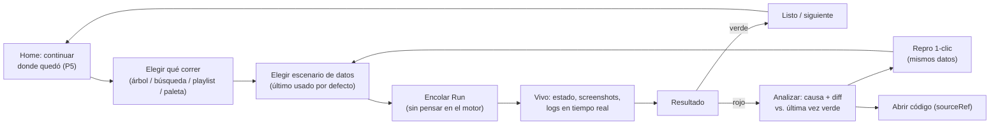
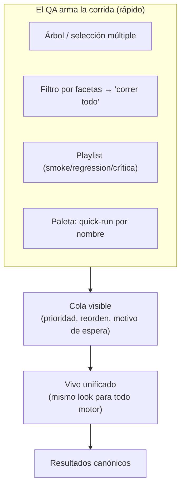

# Plataforma de Control del Framework — Diseño Funcional de la Experiencia del QA

> **Rol de este documento.** Análisis **funcional** de cómo un equipo de QA usará a diario la plataforma-centro-de-control. No es arquitectura, no es implementación, no propone tecnologías ni motores. Describe **qué debe poder hacer el QA, cómo debe sentirse el flujo y por qué**, con la justificación de cada decisión (qué dolor concreto resuelve) y las alternativas descartadas.
>
> **Es ADITIVO.** Asume que la arquitectura de [`plataforma-de-control-arquitectura.md`](./plataforma-de-control-arquitectura.md) **ya fue aprobada** y **no la reemplaza ni la contradice**. Todo lo que sigue se construye *encima* de sus conceptos ya definidos y los referencia por nombre. En particular:
> - No rompe el **desacople del motor**: nada de lo funcional conoce Selenium, Mocha ni ningún motor. El QA nunca piensa en el motor.
> - No modifica el **Input Model** (§18 del doc de arquitectura): construye funcionalidades *alrededor* de él.
> - No introduce **registro manual de tests**: todo se apoya en el **descubrimiento automático** y el **Manifiesto de Descubrimiento** ya diseñados.

---

## 0. Índice

- [1. Principios de experiencia que gobiernan todo el diseño](#1-principios-de-experiencia-que-gobiernan-todo-el-diseño)
- [2. Mapeo funcional ↔ entidades canónicas (para no reinventar el modelo)](#2-mapeo-funcional--entidades-canónicas-para-no-reinventar-el-modelo)
- [3. Flujo completo de trabajo del QA (día a día)](#3-flujo-completo-de-trabajo-del-qa-día-a-día)
- [4. Organización y navegación](#4-organización-y-navegación)
- [5. Ejecución](#5-ejecución)
- [6. Datos de entrada: trabajar alrededor del Input Model](#6-datos-de-entrada-trabajar-alrededor-del-input-model)
- [7. Resultados](#7-resultados)
- [8. Historial](#8-historial)
- [9. Productividad: funcionalidades que ahorran tiempo real](#9-productividad-funcionalidades-que-ahorran-tiempo-real)
- [10. Escalabilidad de la experiencia (miles de casos, decenas de módulos, múltiples motores)](#10-escalabilidad-de-la-experiencia)
- [11. Priorización y hoja de ruta funcional](#11-priorización-y-hoja-de-ruta-funcional)
- [12. Riesgos funcionales y decisiones abiertas](#12-riesgos-funcionales-y-decisiones-abiertas)
- [13. Cierre](#13-cierre)

---

## 1. Principios de experiencia que gobiernan todo el diseño

Antes de cualquier pantalla, estas reglas de producto son la vara con la que se justifica cada decisión de este documento. Un equipo que va a vivir dentro de esta herramienta ocho horas al día durante años no tolera fricción repetida: cada clic de más se multiplica por miles de ejecuciones.

| # | Principio | Dolor del QA que evita |
|---|---|---|
| P1 | **Cero registro manual.** Todo lo que el QA ve nace del descubrimiento automático. El QA nunca "da de alta" un test, una suite ni un módulo. | Listas que se desincronizan del código; el clásico "el test existe pero no aparece". |
| P2 | **El QA nunca inventa nombres.** Ni de propiedades de datos (lo garantiza el Input Model), ni de tags críticos, ni de escenarios que ya existen: la plataforma siempre ofrece lo que ya hay antes de dejar escribir texto libre. | Tipeos divergentes (`smoke` vs `Smoke` vs `smoke-test`) que fragmentan filtros y reportes. |
| P3 | **Tiempo-hasta-resultado mínimo.** Desde "quiero correr esto" hasta "lo estoy viendo correr" deben mediar segundos y pocos clics. Toda acción frecuente tiene un atajo. | El costo acumulado de reconfigurar lo mismo cada día. |
| P4 | **Nada se configura dos veces.** Todo lo que el QA arma (una selección, un set de valores, un filtro, un panel) se puede **guardar, nombrar, reutilizar y compartir**. | Rehacer manualmente la misma corrida ad-hoc, el mismo dato de prueba, el mismo filtro. |
| P5 | **Continuidad de contexto.** La plataforma recuerda lo último que hiciste (caso, escenario, ambiente, selección) y lo ofrece como punto de partida. El "camino de ayer" es el atajo de hoy. | Reconstruir mentalmente dónde estabas cada mañana. |
| P6 | **El fallo se entiende en segundos, no en minutos.** Un resultado fallido presenta *primero* la causa probable y el cambio respecto de la última vez que pasó, no un volcado plano de logs. | Bucear en stack traces y carpetas de screenshots para reconstruir qué pasó. |
| P7 | **La herramienta escala sin sobrecargar.** Con 3 casos o con 3.000, la navegación, la búsqueda y las vistas siguen siendo usables; nada obliga a scrollear listas infinitas. | La parálisis de una lista plana de miles de ítems. |
| P8 | **El motor es invisible.** El QA piensa en "casos", "datos", "resultados" — nunca en Selenium/Playwright/Postman. La misma UI y los mismos gestos sirven para cualquier motor. | Tener que aprender una herramienta distinta por cada tecnología de automatización. |

> Estos principios son la razón por la que muchas decisiones de abajo *no* se resuelven "con un campo de texto libre" sino "ofreciendo lo descubierto". La productividad de un equipo grande se juega en esos detalles.

---

## 2. Mapeo funcional ↔ entidades canónicas (para no reinventar el modelo)

Todo lo funcional se apoya en entidades que **ya existen** en la arquitectura aprobada. Esta tabla evita inventar conceptos nuevos donde ya hay uno, y hace explícito qué es **derivado/proyección** (sin costo de mantenimiento manual) y qué es **nuevo pero aditivo** (construido encima, sin tocar el modelo).

| Concepto funcional (este doc) | Se apoya en (doc de arquitectura) | Naturaleza |
|---|---|---|
| Árbol Módulo → Suite → Caso | `Module` / `Suite` / `TestCase` del **Manifiesto de Descubrimiento** | Derivado (descubrimiento) |
| "Ver el código del test" | `TestCase.sourceRef` | Derivado |
| Editor de parámetros | `InputModel` + `InputParameter` (`origin`/`type`/`options`/`default`) | Se apoya, no modifica |
| Escenario / plantilla de datos | Materialización con valores del `InputModel` = **`TestData`** (`data/execution-context.json`) | **Nuevo aditivo** (nombra y versiona `TestData`) |
| Correr algo | `Run` con `Run.seleccion` (caso/suite/módulo/glob/tags) | Se apoya |
| Cola / prioridades | Orquestador + cola del control plane | Se apoya (capa de UX encima) |
| Resultado de un caso | `Result` (estado, `duracionMs`, `error`, `artifactRefs`) | Derivado |
| Screenshot/log/evidencia | `Artifact` (`tipo`, `uri` servible) | Derivado |
| Ambiente de una corrida | `RunEnvironment` (ambiente/SO/navegador/usuario) | Derivado |
| Historial / tendencias / flakiness | `HistoryEntry` (proyección append-only de `Result`) | Derivado |
| Tags (smoke/regression/critical) | Tags del `TestCase` (derivados + declarados) | Derivado + anotación aditiva |
| Playlist / colección ad-hoc | Una `Run.seleccion` **guardada y nombrada** | **Nuevo aditivo** |
| Favoritos / recientes / más usados | Proyecciones per-usuario sobre `Run` / `HistoryEntry` | **Nuevo aditivo** (proyección) |

> **Regla aditiva clave:** ningún concepto funcional nuevo **materializa datos duplicados**. Un Escenario nombra un `TestData`; una Playlist nombra una selección; Favoritos/Recientes son *consultas guardadas* o *proyecciones*, no copias. Esto respeta la decisión de almacenamiento del doc de arquitectura (referenciar, no duplicar) y evita el peor enemigo de una herramienta que vive años: los datos que se desincronizan.

---

## 3. Flujo completo de trabajo del QA (día a día)

Esta sección recorre la jornada extremo a extremo. Cada momento se diseña con su "camino feliz" y sus caminos de recuperación. El hilo conductor es P3 y P5: la plataforma arranca donde el QA lo dejó y minimiza los pasos hasta el resultado.

### 3.0. El "home" del QA: continuar donde quedó

Al abrir la plataforma, el QA no ve una pantalla vacía ni un árbol frío. Ve un **tablero de continuidad**:
- **Reanudar:** la última corrida y su resultado, con un botón "volver a correr igual".
- **Recientes:** últimos casos/suites tocados (P5).
- **Fallos que requieren atención:** casos que pasaron a rojo desde la última vez que estaban verdes (el delta, no la lista completa).
- **Mis favoritos** y **más usados** (P4/P9).

**Justificación:** un QA de regresión repite el 80% de sus acciones. Presentarle su contexto de ayer elimina el trabajo de reconstruirlo. **Alternativa descartada:** un dashboard genérico de métricas globales como home — es lindo para un manager, inútil para el operador diario; se relega a un panel opcional (§9.6).

### 3.1. Crear un test nuevo → que aparezca solo (P1)

El QA escribe el caso en el código siguiendo la convención existente (un archivo, nombre descriptivo, declaración de sus *Input Sources* co-localizada). **No toca la plataforma para "registrarlo".** El descubrimiento automático lo detecta (la invalidación por huella del Manifiesto ya lo contempla) y el caso **aparece** en el árbol, con:
- su ubicación Módulo → Suite → Caso,
- su editor de parámetros ya construido desde el `InputModel` (con los nombres reales),
- su vínculo a las pantallas de metadata (`pantallas` del manifiesto),
- "ver código" listo vía `sourceRef`.

**Experiencia de recuperación:** si el QA está mirando la plataforma cuando agrega el caso, un indicador discreto ("descubrimiento actualizado — 1 caso nuevo") le ofrece saltar a él. Nunca hay un botón "sincronizar" obligatorio: es automático; el manual es solo un atajo por si tiene apuro.

**Justificación:** el flujo "escribí el test → apareció con todo su contexto" es la prueba de fuego de P1. Que el editor de datos ya exista sin que nadie definiera propiedades es la prueba de fuego de P2.

### 3.2. Configurar datos de entrada

El QA abre el caso y ve su **editor de parámetros** (detalle en §6/§... —ver [Datos de entrada](#6-datos-de-entrada-trabajar-alrededor-del-input-model)). Rellena valores donde quiere dirigir la prueba y deja vacío lo que quiere que el framework descubra solo (comportamiento que el runtime ya tiene: vacío ⇒ descubrimiento automático). Puede guardar ese conjunto como **Escenario** ("REQ autorizada real", "datos mínimos", "caso borde").

### 3.3. Ejecutar una prueba / suite / módulo / varios módulos

Desde cualquier nodo del árbol (o desde la paleta de comandos, §9.1) el QA dispara la ejecución de:
- **un caso** (con el escenario elegido o el último usado),
- **una suite** (todos sus casos),
- **un módulo** (todas sus suites),
- **varios módulos** o una **Playlist** curada que cruza módulos.

En todos los casos la plataforma arma una `Run` con la `seleccion` correspondiente y la encola. El QA **no elige motor**: cada caso ya sabe con qué adaptador corre; si la selección mezcla motores, la cola los coordina de forma transparente (§5.8, P8).

### 3.4. Ver la corrida en vivo

Al encolar, el QA salta (o no — puede seguir trabajando) a la **vista en vivo** de la corrida: lista de casos con su estado cambiando en tiempo real, el caso actual resaltado, screenshots y logs apareciendo a medida que ocurren, y un progreso global (N/total, tiempo transcurrido, ETA estimada por el promedio histórico de cada caso). Esto se apoya en el streaming de eventos ya diseñado; la fidelidad crece por fases (derivado de logs primero, evento-a-evento después) sin cambiar la experiencia base.

### 3.5. Detener y "reanudar"

- **Detener:** un botón cancela la corrida. La plataforma marca los casos no ejecutados como cancelados y **conserva** los resultados ya obtenidos (nada se pierde).
- **"Reanudar":** funcionalmente, "continuar" una corrida = lanzar una **corrida hija** cuya `seleccion` son *solo los casos que no pasaron* (fallidos + pendientes + cancelados) de la corrida padre, con los mismos parámetros y datos. Queda **enlazada** a la padre para que el historial muestre "corrida 2 (continuación de la 1)".

**Justificación:** arquitectónicamente un `Run` es inmutable (event log, historial confiable); "reanudar" mutándolo rompería esa garantía. Modelar "continuar" como una corrida hija con selección reducida **respeta la inmutabilidad** y además le da al QA justo lo que quiere: no reejecutar lo que ya pasó. **Alternativa descartada:** reanudar mutando la corrida original — contamina el historial y la reproducibilidad.

### 3.6. Revisar resultados, analizar fallos, depurar

El QA abre el resultado (§7). Para un fallo, la plataforma le muestra **primero** la causa y el **diff respecto de la última corrida donde ese caso pasó** (P6). Desde ahí, en un clic, puede:
- **re-correr solo ese caso** con exactamente los mismos datos (repro 1-clic),
- **abrir el código** en el punto exacto (`sourceRef`),
- **ajustar el escenario** y re-correr,
- **clonar el escenario** para probar una variante sin perder el original.

Este bucle "fallo → repro → ajuste → re-corro" es el corazón de la depuración y está diseñado para no salir nunca de la misma pantalla (§7.5).

### 3.7. Reutilizar y compartir

Todo lo que armó (escenario, playlist, filtro, panel) puede **guardarlo, reutilizarlo mañana y compartirlo** con el equipo (§6.4, §9). El compañero recibe exactamente la misma configuración, sin reconstruir nada.

---

## 4. Organización y navegación

El reto de escala (P7) es que **con miles de casos, un árbol plano no sirve**. La organización debe ser multidimensional y, sobre todo, **derivada** —no mantenida a mano (P1).

### 4.1. La estructura primaria: el árbol descubierto

Módulo → Suite → Caso, exactamente como lo entrega el Manifiesto. Es la columna vertebral porque es la que el código ya define. Cada nodo muestra, sin trabajo extra del QA, señales agregadas: último estado, estabilidad (§8.5), tiempo promedio, nº de escenarios guardados.

### 4.2. Dimensiones transversales: tags, categorías y facetas **derivadas**

Un árbol es un solo eje. El QA necesita cruzar el catálogo por otros ejes, y todos deben **derivarse** para no violar P1:

| Dimensión | De dónde se deriva (sin registro manual) |
|---|---|
| **Acción/intención** (`crear`, `pausar`, `publicar`, `importar`…) | Del **prefijo del nombre descriptivo** del caso (la convención ya existe: `crear-req-*`, `pausar-*`, `publicar-*`). |
| **`kind`** (Form / Action / Navigation / Validation / Mixto) | Del `InputModel` (etiqueta derivada de las *Input Sources*, ya definida en §18.2 del doc de arquitectura). |
| **Pantallas involucradas** | Del campo `pantallas` del manifiesto (cruce con `metadata/screens`). |
| **Motor** | Del `engineId` del caso. |
| **Salud** (estable / inestable / rojo / nunca corrido) | De `HistoryEntry` (§8.5). |

**El único metadato declarativo que se admite** —y solo porque no puede derivarse— son las **etiquetas de propósito de corrida**: `smoke`, `regression`, `critical`. Estas expresan *intención de negocio* que el nombre no captura. Se declaran **co-localizadas con el caso** (una anotación junto a la declaración de Input Sources que ya existe), **no** en un registro central de la plataforma. Sigue siendo "descubierto": la plataforma las lee del manifiesto, no las administra.

**Justificación:** derivar tags del nombre y del Input Model elimina el trabajo de etiquetar y —crucial— **garantiza consistencia** (P2): no hay `smoke` vs `Smoke`. Para lo que sí requiere intención humana (¿este caso es "crítico"?), se admite anotación mínima pero **junto al código**, nunca como lista aparte. **Alternativa descartada:** un gestor de tags en la UI donde el QA etiqueta casos a mano — se desincroniza del código, fragmenta por tipeos y viola P1.

### 4.3. Búsqueda y filtrado

- **Búsqueda global instantánea** (un atajo de teclado la invoca desde cualquier lado): encuentra casos, suites, módulos, escenarios y playlists por nombre. Tolerante a fragmentos ("pub req" → `publicar-requisicion`).
- **Filtros por facetas combinables:** por cualquier dimensión de §4.2 (ej.: `kind = Form` **y** `tag = smoke` **y** `salud = inestable` **y** `módulo = Reclutamiento`). El resultado es una lista viva que se puede **correr entera** o **guardar como Playlist** (§4.5).
- **Búsqueda por datos:** "casos que tienen un parámetro `clasificacion`" o "casos que tocan la pantalla `requisiciones-detalle`" — posible porque el Input Model y el manifiesto lo exponen.

**Justificación:** a escala, encontrar es más frecuente que navegar. La búsqueda + facetas es el mecanismo que mantiene la herramienta usable con miles de casos (P7).

### 4.4. Favoritos, recientes y más usados

- **Favoritos:** el QA marca casos/suites/playlists; aparecen fijados. Es curación personal explícita.
- **Recientes:** proyección automática de lo último tocado/ejecutado (P5).
- **Más usados:** proyección sobre `Run` — los casos que este QA (o el equipo) más ejecuta. Sube a la superficie lo que de verdad se corre.

Los tres son **proyecciones per-usuario**, no estructuras nuevas: cero mantenimiento, cero duplicación.

### 4.5. Playlists (colecciones ad-hoc) — sin registro manual de tests

Una **Playlist** es una **`Run.seleccion` guardada y nombrada**: "Smoke de Reclutamiento antes de release", "Los 5 casos que estoy debuggeando", "Regresión de documentos". Puede definirse de dos formas, y esta distinción es clave para no violar P1:
- **Dinámica (recomendada):** por un *filtro* (ej. `tag = smoke AND módulo = Reclutamiento`). Cuando aparece un caso nuevo que cumple el filtro, **entra solo** a la playlist. No hay lista manual que mantener.
- **Estática:** una selección explícita de casos ya descubiertos (para el set puntual "lo que estoy debuggeando").

**Ninguna de las dos registra tests**: ambas **referencian** casos que el descubrimiento ya conoce. La estática es una selección; la dinámica es un guardado de filtro.

**Justificación:** las playlists dinámicas son la forma correcta de tener "el smoke suite" sin mantener una lista que se pudre. **Alternativa descartada:** suites manuales curadas a mano como primer ciudadano — reintroduce el registro manual que P1 prohíbe; se ofrece solo como caso estático secundario para selecciones efímeras.

---

## 5. Ejecución

Toda ejecución es una `Run` con una `seleccion` y unos `params`. La riqueza funcional está en **cómo el QA arma esa selección rápido** y **cómo la cola le da control sin exponerle el motor**.

### 5.1. Ejecución individual

Un clic en el caso (o `Enter` en la búsqueda) lo corre con el **último escenario usado** (P5). Un menú "correr con…" permite elegir otro escenario o ajustar parámetros de corrida (headless sí/no, modo de screenshot, reintentos) sin salir del contexto.

### 5.2. Ejecución múltiple, por carpeta y por módulo

- **Múltiple:** seleccionar varios nodos (casos/suites) y "correr selección".
- **Por carpeta/módulo:** correr un nodo agrupador corre todo lo que cuelga de él (`seleccion` por módulo/suite/glob, ya soportado).
- **Varios módulos:** selección multi-módulo o una playlist que los cruce.

### 5.3. Ejecución por etiquetas / smoke / regression / críticas

Presets de un clic construidos sobre las facetas de §4.2:
- **Smoke:** `tag = smoke` (playlist dinámica de fábrica).
- **Regression:** `tag = regression` o "todo el módulo".
- **Críticas:** `tag = critical`.

Estos presets viven como playlists dinámicas de equipo, versionadas por filtro, no por lista.

### 5.4. Reintentos

Dos niveles, ambos ya soportados por el framework y expuestos funcionalmente:
- **Por corrida:** el QA fija "reintentar casos fallidos hasta N veces" al lanzar (mapea a los reintentos del runtime).
- **Post-hoc:** desde un resultado, "reintentar solo los fallidos" (= la corrida hija de §3.5).

La UI **distingue visualmente** un caso que pasó de primera de uno que pasó al reintentar (señal temprana de *flakiness*, §8.5). **Justificación:** un verde que necesitó 3 intentos no es un verde sano; ocultarlo engaña al equipo.

### 5.5. Cancelación

Cancelar una corrida (global) o **un caso puntual** dentro de una corrida en curso ("saltear este, seguí con el resto"). Lo ya ejecutado se conserva.

### 5.6. Prioridades y cola

La cola es visible y manipulable: el QA ve qué está corriendo, qué espera y en qué orden. Puede:
- **subir la prioridad** de su corrida (ej. un smoke urgente antes de un release salta una regresión larga),
- **reordenar** su propia cola,
- ver **por qué** algo espera (capacidad de ejecutores ocupada).

**Justificación:** sin visibilidad de la cola, "mandé a correr y no pasa nada" es frustración pura. Con ella, el QA entiende y controla su turno. **Alternativa descartada:** cola invisible FIFO rígida — no sirve cuando conviven una regresión de 40 minutos y un smoke de 2.

### 5.7. Ejecución rápida (quick-run)

Desde la paleta de comandos (§9.1): escribir el nombre de un caso y `Enter` lo corre con su último escenario, sin abrir nada. Es el gesto de P3 llevado al extremo.

### 5.8. Múltiples motores en la misma cola (P8)

Cuando una selección mezcla casos de distintos motores, el QA **no lo nota**: la cola despacha cada caso a su adaptador. La vista en vivo y los resultados se ven **idénticos** porque todo pasa por el modelo canónico. Esta es, funcionalmente, la validación de que el desacople le sirve al QA: *una sola forma de trabajar para todas las tecnologías*.

---

## 6. Datos de entrada: trabajar alrededor del Input Model

> **No se modifica el Input Model.** Se construyen funcionalidades encima. El Input Model (§18 del doc de arquitectura) describe *qué* parámetros tiene un caso, con `origin`, `type`, `options`, `required`, `default`, `screenRef`. Este documento diseña *cómo el QA trabaja con esos valores*.

### 6.1. El editor de parámetros

La UI **renderiza el editor desde el Input Model**, sin conocer el caso ni el motor:
- cada `InputParameter` se pinta con el control adecuado según su `type` (texto, enum con sus `options`, switch, selector de archivo…),
- los campos con `origin: form-metadata` se muestran **agrupados y etiquetados** "provienen del formulario X" (por su `screenRef`), con su nombre **real** ya puesto,
- los `origin: declared` (los mínimos de un caso sin formulario, como `nombreRequisicion`/`estado` de `pausar-requisicion`) se muestran como los parámetros propios del caso,
- **dejar un campo vacío es una acción válida y explicada**: la UI indica "vacío ⇒ el framework lo descubre automáticamente" (el comportamiento del runtime que ya existe). Esto es central: el QA no está obligado a llenar todo.

**Justificación de P2 en acción:** como los nombres y opciones vienen del Input Model, el QA **jamás escribe un nombre de propiedad ni adivina un valor de enum** (las 4 clasificaciones de `importar-archivos-requisicion` aparecen como opciones, no como texto libre).

### 6.2. Escenarios: sets de valores con nombre

Un **Escenario** es un `TestData` (valores para el Input Model de un caso) **con nombre**. Ejemplos para `importar-archivos-requisicion`: "Solo CV con PDF real", "Las 4 clasificaciones con fixtures por defecto". El QA puede tener **varios escenarios por caso** y elegir cuál usar al correr.

**Precedencia de valores (herencia), de menor a mayor prioridad:**
1. **Vacío** ⇒ descubrimiento automático del framework (default de fábrica).
2. **`default`** del Input Model (si el parámetro lo trae).
3. **Global del proyecto** (la sección `global` del `execution-context.json` que ya existe — datos compartidos como empresa/usuario).
4. **Escenario** seleccionado.
5. **Override puntual de la corrida** (el QA cambia un valor solo para *esta* ejecución, sin guardarlo).

**Justificación:** esta cascada le da al QA lo mejor de ambos mundos — reusar un escenario estable y, a la vez, tocar un valor puntual sin ensuciar el escenario guardado (P4). **Alternativa descartada:** un único set de valores por caso (lo que hay hoy sin nombres) — obliga a pisar los datos cada vez que se quiere probar otra cosa, y pierde los escenarios anteriores.

### 6.3. Plantillas: valores reutilizables entre casos

Una **Plantilla** captura un fragmento de valores reutilizable **entre casos** (no atado a uno): p. ej. "credenciales del ambiente QA", "empresa Cia_0042025", "un empleado válido para sustitución". Al configurar un caso, el QA aplica una plantilla y esta rellena los parámetros cuyo **nombre coincide** (posible porque los nombres son canónicos, P2).

**Justificación:** el mismo dato (una empresa, un usuario) se usa en decenas de casos; capturarlo una vez y aplicarlo evita retipearlo. **Diferencia con Escenario:** el Escenario es *específico de un caso* (su `TestData` completo); la Plantilla es *transversal* (un fragmento por nombre de parámetro).

### 6.4. Importar / exportar / compartir

- **Exportar/Importar** escenarios y plantillas como archivos portables (mismo formato editable a mano que ya usa `execution-context.json`, coherente con la decisión de que sea versionable).
- **Compartir con el equipo:** un escenario/plantilla puede publicarse a un espacio de equipo; los compañeros lo ven y lo usan sin reconstruirlo. Los datos sensibles se enmascaran según la política de secretos ya definida en la arquitectura (§14) — un escenario compartido nunca filtra una contraseña.

**Justificación:** el conocimiento "qué datos hacen pasar/fallar este caso" es capital del equipo; hoy vive en la cabeza de quien lo escribió. Hacerlo compartible lo convierte en activo colectivo (P4). **Alternativa descartada:** que cada QA mantenga su propio `execution-context.json` local — fragmenta el conocimiento y produce "en mi máquina anda".

### 6.5. Sincronización del editor cuando cambia el formulario

Cuando la metadata de una pantalla cambia (el formulario ganó/perdió campos), el editor se actualiza solo apoyándose en la **invalidación por sello** ya diseñada (§18.7 del doc de arquitectura):
- **campos nuevos** aparecen (vacíos) en el editor;
- **campos eliminados** se marcan como obsoletos **sin borrar** el valor que el QA había puesto (se avisa, no se destruye);
- los escenarios guardados siguen válidos; solo se señala qué parámetro quedó huérfano.

**Justificación:** el QA no debe perder trabajo porque el formulario evolucionó; y debe **enterarse** del cambio, no descubrirlo por un fallo. Esto es P6 aplicado a los datos.

---

## 7. Resultados

El objetivo rector es P6: **entender un resultado —sobre todo un fallo— en segundos**. Todo se apoya en `Result` y `Artifact` canónicos, así que se ve igual para cualquier motor.

### 7.1. La vista de un resultado (jerarquía de lectura)

Se presenta en orden de *lo que el QA necesita primero*:
1. **Veredicto y causa:** pasó/falló y, si falló, el **mensaje de error normalizado** arriba de todo, en lenguaje humano, no el stack crudo.
2. **El momento del fallo:** el screenshot del instante del fallo (el framework ya captura en modo `fail`), con el paso/acción que lo produjo.
3. **Qué cambió:** el **diff respecto de la última corrida donde el caso estaba verde** (§7.4). Muchas veces la causa es "cambió el ambiente" o "cambió este dato", y esto lo revela sin bucear.
4. **Detalle expandible:** stack trace completo, logs con timestamps, todas las evidencias (screenshots, JSON de bloqueo, videos si los hubiera), tiempos por paso.
5. **Contexto de reproducción:** el `RunEnvironment` (ambiente/navegador/usuario) y el `TestData` exacto con el que corrió — para reproducir idéntico.

**Justificación:** un volcado plano obliga a leer todo para encontrar lo importante. La jerarquía pone la causa probable primero y esconde el detalle hasta que se necesita. **Alternativa descartada:** mostrar el `results.json`/reporte HTML crudo — ata la lectura al formato del motor y entierra la causa.

### 7.2. Screenshots y evidencias

- **Galería por caso** dentro del resultado, en orden temporal, con etiqueta (el `label` de cada `Artifact`: "Tras pulsar Pausar", "Listado tras pausar").
- **Screenshot de fallo destacado** y diferenciado de los screenshots de paso.
- Evidencias no visuales (JSON de bloqueo, logs) accesibles pero sin robar protagonismo.
- Los binarios se **sirven** desde donde el framework ya los deja (no se duplican), coherente con la arquitectura.

### 7.3. Logs y tiempos

- **Log con timestamps** filtrable (por nivel, por texto), alineado temporalmente con los screenshots: hacer clic en una línea de log resalta el screenshot de ese momento y viceversa.
- **Tiempos:** duración total y **por paso/acción**, con el paso más lento resaltado — útil para detectar degradaciones de performance del sistema bajo prueba.

### 7.4. Diferencias entre ejecuciones y "qué cambió"

Dos comparaciones, ambas de altísimo valor:
- **Contra la corrida anterior del mismo caso:** ¿pasó a rojo? ¿tardó el doble? ¿cambió el mensaje de error? ¿cambió el ambiente o el dato?
- **Contra la última corrida verde:** el diff más útil para depurar una regresión ("funcionaba, ¿qué cambió desde entonces?").

El diff cubre: estado, duración (con umbral de alerta), mensaje de error, `RunEnvironment`, y `TestData`. Presenta el cambio en lenguaje claro: *"Antes: verde con ambiente QA. Ahora: rojo — 'no se encontró el botón Pausar'. El dato `idRequisicion` cambió de 1090 a 1078."*

**Justificación:** el 90% del análisis de un fallo es "¿qué es distinto respecto de cuando andaba?". Automatizar esa comparación es, probablemente, la feature de mayor ROI del producto (§9). **Alternativa descartada:** dejar que el QA abra dos corridas en pestañas y compare a ojo — es lento y propenso a error.

### 7.5. El bucle de depuración (todo en una pantalla)

Desde el resultado de un fallo, sin cambiar de contexto:
- **Reproducir** (re-correr el caso con el mismo `TestData` y ambiente),
- **Abrir el código** en el punto exacto (`sourceRef`),
- **Ajustar un dato** y re-correr (override puntual, §6.2),
- **Clonar el escenario** para una variante,
- **Marcar como flaky / crear una nota** que quede en el historial del caso.

**Justificación:** cada salto de contexto en la depuración cuesta foco y tiempo. Concentrar el bucle "veo el fallo → lo reproduzco → lo ajusto → lo re-corro" en un solo lugar es lo que convierte a la herramienta en un entorno de trabajo, no un visor.

---

## 8. Historial

El historial se apoya en `HistoryEntry` (proyección append-only de `Result`), así que responder estas preguntas no requiere recorrer todas las corridas. El valor funcional es **construir confianza en la suite**: saber en qué casos se puede confiar y cuáles mienten.

### 8.1. Vistas de consulta

| Pregunta del QA | Vista |
|---|---|
| ¿Qué corrió últimamente? | **Timeline de corridas** (filtrable). |
| ¿Qué corrió *tal persona*? | Filtro por `triggeredBy`. |
| ¿Cómo anda *tal ambiente*? | Filtro por `RunEnvironment` (QA/test/prod-like). |
| ¿Cómo anda *tal módulo/caso*? | Historial por `Module` / `TestCase`. |
| ¿Dónde se concentran los fallos? | **Mapa de calor** de fallos por módulo/caso. |
| ¿Cuánto tarda esto normalmente? | **Tiempo promedio** y su tendencia por caso/suite. |
| ¿Puedo confiar en este caso? | **Estabilidad** (§8.5). |

### 8.2. Tendencias de fallos

Para un caso, suite o módulo: la línea de tiempo de verdes/rojos, con anotaciones de *cuándo* empezó a fallar y *qué cambió* alrededor de ese punto (cruzando con el diff de §7.4). Responde "¿esto viene fallando o es de hoy?".

### 8.3. Tiempo promedio y su deriva

No solo el promedio: su **tendencia**. Un caso que pasó de 15s a 40s en dos semanas es una señal de degradación del sistema bajo prueba que el QA debe ver aunque el caso siga verde.

### 8.4. Historial por caso: la "ficha del caso"

Cada caso tiene una **ficha** que consolida: sus últimas N corridas, su estabilidad, su tiempo promedio y tendencia, sus escenarios guardados, las pantallas que toca, su código, y notas del equipo. Es el lugar único al que ir para saber *todo* sobre un caso.

### 8.5. Estabilidad / flakiness

Un **índice de estabilidad** por caso, derivado del historial: proporción de verdes, cuántas veces necesitó reintento para pasar, y variabilidad de resultado ante el mismo dato. Se traduce a una señal simple (estable / sospechoso / inestable) visible en el árbol, la búsqueda y las playlists.

**Justificación:** los tests *flaky* son el cáncer de una suite grande: erosionan la confianza hasta que "todos ignoran los rojos". Hacer la inestabilidad **visible y medible** permite atacarla (§4.3: filtro "salud = inestable" → playlist → foco de trabajo). **Alternativa descartada:** tratar todo verde/rojo como binario — esconde el flaky y deja que pudra la suite.

---

## 9. Productividad: funcionalidades que ahorran tiempo real

Todo lo anterior ya reduce trabajo. Esta sección junta las funciones **puramente de productividad** cuyo único fin es minimizar el trabajo manual repetido (P3/P4/P5), y cierra con las de mayor ROI.

### 9.1. Paleta de comandos (el acelerador universal)

Un atajo de teclado abre una paleta donde el QA escribe intención en texto: "correr publicar-requisicion", "abrir ficha pausar", "smoke reclutamiento", "comparar últimas dos de crear-req-comentarios". Ejecuta cualquier acción frecuente **sin navegar**. Es la materialización de P3.

**Justificación:** para un usuario experto que vive en la herramienta, el mouse es el cuello de botella. Una paleta de comandos convierte 5 clics en 3 teclas. **Alternativa descartada:** confiar solo en la navegación por árbol — óptima para explorar, lentísima para lo repetitivo.

### 9.2. Ejecución rápida con datos recientes

"Correr como la última vez": un gesto que reejecuta un caso/playlist con **exactamente** el escenario, ambiente y parámetros de su última corrida (P5). El 80% de las veces es lo que el QA quiere.

### 9.3. Reutilización y clonación

- **Clonar escenario:** duplicar un escenario para probar una variante sin tocar el original.
- **Clonar playlist:** partir de una selección existente y ajustarla.
- **Aplicar plantilla:** rellenar datos por nombre (§6.3).

Todo "clonar y ajustar" en vez de "empezar de cero" (P4).

### 9.4. Comparaciones de un clic

Desde dos corridas (o desde la ficha de un caso), "comparar" abre el diff de §7.4. Accesible también desde la paleta.

### 9.5. Accesos rápidos

Favoritos fijados, recientes, más usados (§4.4) y **acciones sugeridas contextuales** ("este caso falló 3 veces hoy → ¿ver su ficha?", "el smoke no corre desde hace 5 días → ¿correrlo?").

### 9.6. Paneles personalizados

El QA (o el equipo) arma **dashboards** con las tarjetas que le importan: "salud del módulo Reclutamiento", "mis casos inestables", "últimas corridas del equipo", "casos más lentos". Son **vistas guardadas** sobre proyecciones existentes, no datos nuevos. Distinto por rol: un QA operador quiere "mis fallos de hoy"; un lead quiere "tendencia de estabilidad del release".

### 9.7. Las 5 funcionalidades de mayor ROI

Si hubiera que elegir cinco por su relación impacto/esfuerzo:

| # | Feature | Por qué es la de mayor ROI |
|---|---|---|
| 1 | **Diff "qué cambió respecto de la última vez verde" (§7.4)** | Colapsa el análisis de fallos de minutos a segundos; se usa en *cada* rojo. |
| 2 | **Repro 1-clic con los mismos datos (§7.5)** | El bucle de depuración es lo más frecuente del día; eliminar su fricción multiplica. |
| 3 | **Escenarios de datos con nombre + "correr como la última vez" (§6.2, §9.2)** | Elimina el retipeo de datos, el trabajo manual más repetido y aburrido. |
| 4 | **Playlists dinámicas por filtro (smoke/regression) (§4.5)** | Da "suites de propósito" que no se mantienen a mano y nunca se desactualizan. |
| 5 | **Señal de estabilidad/flakiness visible (§8.5)** | Protege el activo más valioso: la *confianza* en la suite, sin la cual todo lo demás da igual. |

---

## 10. Escalabilidad de la experiencia

Diseñar para 3.000 casos y decenas de módulos, no para hoy. La escala no es solo técnica (eso lo cubre la arquitectura); es **cognitiva y de interacción**.

- **Nunca una lista plana infinita.** Todo listado (casos, corridas, historial) es paginado/virtualizado y, sobre todo, **se llega por búsqueda o filtro**, no por scroll. El árbol se carga perezoso por nivel.
- **Facetas como mapa mental.** Con miles de casos, el QA no memoriza el árbol; navega por intención (`kind`, acción, salud, módulo). Las facetas de §4.2 son las que hacen esto posible **sin trabajo de catalogación** (todas derivadas).
- **Agregados antes que detalle.** Cada nodo agrupador muestra señales resumidas (salud, tiempo, nº de fallos) para decidir dónde profundizar sin abrir todo.
- **Multi-motor sin multiplicar la UI.** Agregar un motor **no agrega pantallas**: los casos del motor nuevo aparecen en el mismo árbol, con el mismo editor, los mismos resultados. La única diferencia visible es, si acaso, un ícono de motor. Esto es lo que evita que la herramienta se vuelva N herramientas (P8).
- **Multi-proyecto/tenant.** Un selector de proyecto acota todo el espacio de trabajo; el QA vive dentro de su proyecto y no ve el ruido de otros. Coherente con el `projectId` ya previsto.
- **Rendimiento percibido.** Las vistas de lectura (árbol, historial, resultados) deben sentirse instantáneas porque se apoyan en proyecciones (`HistoryEntry`, índices), no en recomputar sobre miles de corridas. El QA percibe fluidez aunque el volumen crezca.

**Justificación:** una herramienta que es un placer con 50 casos y una tortura con 5.000 fracasa justo cuando más se la necesita. La organización derivada + búsqueda/facetas + agregados es lo que mantiene constante la experiencia mientras el catálogo crece órdenes de magnitud.

---

## 11. Priorización y hoja de ruta funcional

### 11.1. Priorización (impacto en productividad vs. dependencia arquitectónica)

La "dependencia" indica qué fase de la arquitectura habilita cada feature (para no prometer lo que aún no tiene cimiento).

| Funcionalidad | Impacto productividad | Depende de (fase arq.) | Prioridad |
|---|---|---|---|
| Árbol descubierto + ficha de caso + "ver código" | Alto | Fase 1 (descubrimiento + lectura) | **Ya / base** |
| Editor de parámetros desde Input Model | Alto | Fase 1–2 (Input Model + edición) | **Alta** |
| Ver resultados / screenshots / logs / evidencias | Alto | Fase 1 | **Alta** |
| Historial + estabilidad/flakiness | Alto | Fase 1 (índice de historial) | **Alta** |
| Diff "qué cambió" (§7.4) | **Muy alto** | Fase 1 (dos runs normalizados) | **Alta** |
| Ejecutar caso/suite/módulo desde la UI | Alto | Fase 2 (ejecución) | **Alta** |
| Escenarios/plantillas de datos + compartir | Alto | Fase 2 + espacio de equipo | **Alta** |
| Vivo (estado/screenshots en tiempo real) | Medio-alto | Fase 2 (derivado) → Fase 3 (fiel) | **Media** (crece por fases) |
| Cola visible + prioridades | Medio | Fase 2 | **Media** |
| Playlists dinámicas + presets smoke/regression | Alto | Fase 2 (selección) | **Media-alta** |
| Paleta de comandos / quick-run | Alto (usuarios expertos) | Fase 2 | **Media** |
| Reanudar como corrida hija | Medio | Fase 2 | **Media** |
| Favoritos / recientes / más usados | Medio | Fase 1–2 (proyecciones) | **Media** |
| Paneles personalizados | Medio | Fase 1–2 | **Baja-media** |
| Compartir entre equipo (con redacción de secretos) | Alto (a escala) | Fase 4 (multi-usuario/seguridad) | **Media** (gated por seguridad) |
| Multi-motor / multi-proyecto en la misma UX | Estratégico | Fase 5 | **Estratégica** |

### 11.2. Hoja de ruta funcional (alineada a las fases de la arquitectura)

- **Sobre Fase 1 (lectura):** árbol descubierto, ficha de caso, ver código/resultados/evidencias/logs, historial + estabilidad, **diff "qué cambió"**, favoritos/recientes, búsqueda + facetas derivadas. → *La herramienta ya es un centro de control valioso aunque todavía no ejecute.*
- **Sobre Fase 2 (ejecución):** correr caso/suite/módulo/playlist, editor de parámetros con escenarios/plantillas, cola visible + prioridades, reintentos, cancelación, reanudar (corrida hija), quick-run/paleta, vivo derivado de logs. → *El QA ya trabaja el día completo dentro de la plataforma.*
- **Sobre Fase 3 (vivo fiel):** vivo evento-a-evento, reconexión sin lagunas, múltiples QAs viendo la misma corrida. → *La observación en tiempo real se vuelve confiable.*
- **Sobre Fase 4 (multi-usuario/seguridad):** compartir escenarios/plantillas/playlists con redacción de secretos, historial por usuario, paneles por rol. → *Deja de ser una herramienta individual y pasa a ser del equipo.*
- **Sobre Fase 5 (escala/multi-motor):** todo lo anterior **idéntico** con casos de un segundo motor y varios proyectos. → *La prueba de que la experiencia no dependía del motor.*

---

## 12. Riesgos funcionales y decisiones abiertas

1. **Riesgo: el metadato declarativo (tags de propósito) se vuelve registro manual encubierto.** Mitigación: mantenerlo co-localizado con el caso, mínimo (solo lo que no puede derivarse) y leído del manifiesto. Decisión abierta: ¿se permite además una *anotación de solo-UI* (favoritos ya lo es) o todo tag vive junto al código? Recomendación: solo favoritos/notas viven en la UI (son per-usuario); los tags de propósito viven con el caso.
2. **Riesgo: sobre-carga de escenarios.** Con el tiempo, un caso puede acumular decenas de escenarios y volverse ruidoso. Decisión abierta: ¿límites blandos, archivado automático de escenarios sin uso, o curación de equipo? Recomendación: marcar escenarios "sin uso en N meses" y ofrecer archivarlos (nunca borrarlos solos).
3. **Riesgo: el diff "qué cambió" da falsos culpables.** Correlacionar no es causar (que el dato cambiara no prueba que sea la causa). Mitigación: presentarlo como *"posibles cambios relevantes"*, no como veredicto.
4. **Decisión abierta: definición precisa de flakiness.** ¿Cuántos reintentos/variaciones marcan "inestable"? Debe ser configurable por equipo, con un default sensato.
5. **Riesgo: compartir datos filtra secretos.** Gated por la política de redacción de la arquitectura (§14); ningún escenario compartible se publica sin pasar por el enmascarado. Es un bloqueo duro, no una recomendación.
6. **Decisión abierta: quién puede subir prioridad en la cola / cancelar corridas ajenas.** Es política de equipo; se resuelve con los roles de Fase 4 (Viewer/Runner/Admin ya previstos).
7. **Riesgo: paneles personalizados que se vuelven inconsistentes entre personas.** Mitigación: ofrecer paneles de fábrica por rol como punto de partida; lo personalizado es adicional.

---

## 13. Cierre

Este documento define **cómo se trabaja**, apoyado enteramente en **lo que la arquitectura aprobada ya modela**: el descubrimiento automático da el catálogo, el modelo canónico da resultados/artefactos/historial idénticos para todo motor, y el Input Model da el editor de datos sin que nadie invente nombres. Sobre esos cimientos, la capa funcional persigue una sola cosa: que un equipo que escribirá miles de automatizaciones durante años **pierda el mínimo tiempo posible** en todo lo que no sea pensar la prueba.

Las apuestas de mayor retorno —el diff "qué cambió", la reproducción de un clic, los escenarios de datos reutilizables, las playlists que no se mantienen a mano y la visibilidad del flaky— comparten una raíz: **eliminan trabajo manual repetido y protegen la confianza en la suite**. Todo es aditivo, no toca el core de casos, no expone el motor y no introduce ningún registro manual. La herramienta representa lo que el framework describe; el QA solo asigna valores, aprieta correr y entiende el resultado.
